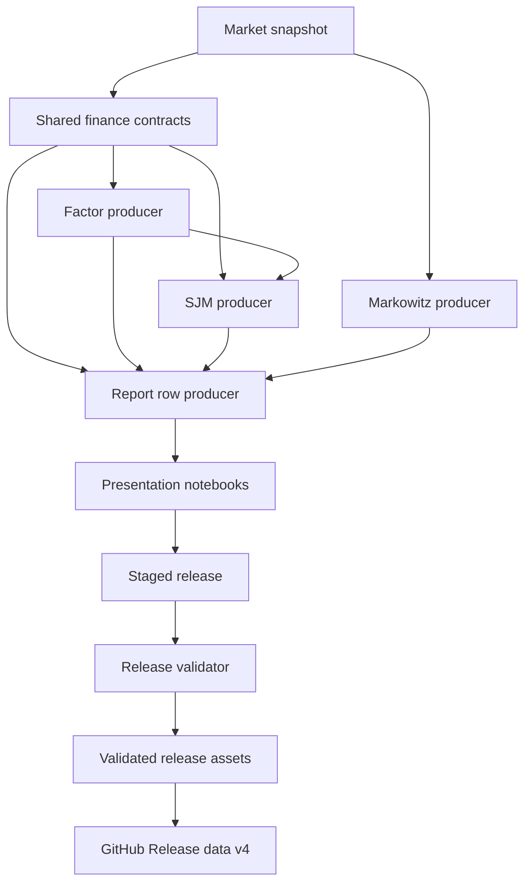
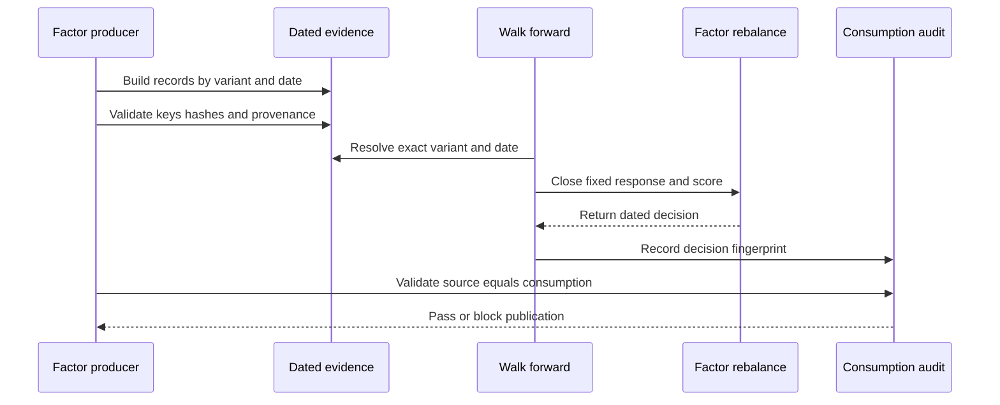
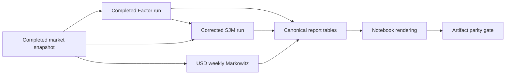
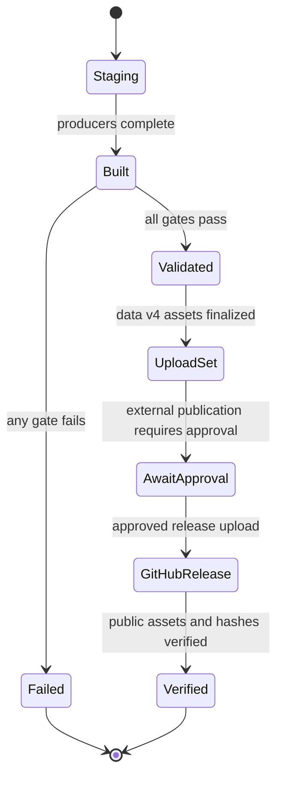
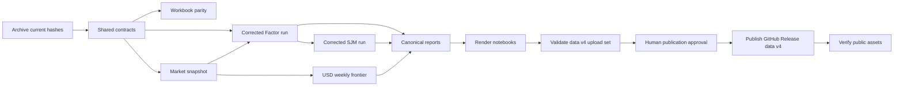

# Technical Design: Finance Metric Integrity Remediation

## Overview

This design corrects the confirmed finance, metric, SSR, attribution, replay, cash, crisis, Markowitz, and publication defects without replacing the repository's existing research architecture. Researchers and report users receive financially coherent tables, figures, and ledgers generated from strict shared calculations and immutable input snapshots.

The selected pattern is a **contract-hardened deterministic producer pipeline with immutable release bundles**. Existing framework modules own numerical invariants; small domain producers own Factor, SJM, Markowitz, and report tables; notebooks become presentation-only consumers; a remediation-specific publisher validates a complete staged bundle before making it current.

The design deliberately preserves two valid metric families: reader-facing elapsed-time/252 metrics and explicitly labeled vectorbt/365 release-parity metrics. It does not mix them in a row or silently rewrite immutable historical releases.

### Goals

- Fix each of the 15 confirmed defect classes at its owning calculation or producer boundary.
- Ensure portfolio Sharpe and SSR use matched BIL total-return excess returns.
- Preserve exact date and variant identity through Factor replay.
- Use one currency and one regular observation grid for Markowitz analysis.
- Regenerate every directly affected artifact from corrected producers.
- Block publication until all deterministic financial and artifact-parity checks pass.

### Non-Goals

- Change the LLM provider, model, prompt task, or scoring objective.
- Retune existing strategy-selection criteria.
- Rebuild every historical strategy in USD.
- Publish CAPM/Jensen alpha for existing mixed-local-currency strategy histories.
- Add general non-daily SSR support.
- Build a generic finance-contract, market-data, or publication framework.
- Modify prior immutable Factor or SJM release bundles.

## Boundary Commitments

### This Spec Owns

- Reader versus legacy metric schema separation.
- Strict price-level alignment, return construction, and first-return anchors.
- Portfolio excess returns and differential-return semantics.
- SSR input construction, validation, metadata, and configured-alpha propagation.
- Honest raw market-model attribution labels and exact attribution windows.
- Boundary-inclusive crisis return, drawdown, and volatility calculations.
- Date-and-variant-specific Factor replay evidence and consumption validation.
- Total-return BIL, SPY, ETF, and USD/GBP snapshot inputs needed by affected outputs.
- SJM residual-cash correction and deterministic strategy reselection.
- Common-grid USD Markowitz inputs and asset-only frontiers.
- Canonical report-row construction and artifact provenance.
- Validated release-asset staging and publication under a new immutable GitHub Release tag.
- Regeneration of directly affected CSV, Parquet, JSON, Markdown, TeX, notebook, and PNG outputs.

### Out of Boundary

- LLM provider/model changes or adding date text to anonymized PIT prompts.
- New strategy features, discretionary tuning, or allocation rules.
- Repository-wide market-data cleanup.
- Retrofitting old immutable release bundles with new values.
- A theoretical risk-free-rate data product or CAPM publication for mixed-local histories.
- General-purpose orchestration, artifact storage, or workflow infrastructure.
- Pixel-identical figure validation.

### Allowed Dependencies

- Python standard library.
- Existing repository modules.
- pandas, NumPy, statsmodels, SciPy, pyarrow, matplotlib, yfinance, requests, vectorbt, numba, and llvmlite within the verified lock ranges.
- recall-guard at git tag v0.2.0 (bumped from v0.1.0 on 2026-07-28 by explicit user direction — upstream release, no API change; `dependency_evidence.json` re-captured accordingly).
- Federal Reserve H.10/FRED `DEXUSUK`, quoted USD per GBP, for the pinned FX snapshot.
- Adjusted total-return market levels from the repository's existing data acquisition path.

No new runtime package is introduced.

### Revalidation Triggers

Full downstream validation is required when any of these change:

- Cash benchmark identity, source, total-return treatment, or snapshot hash.
- FX source, quote direction, vintage, cutoff, or staleness tolerance.
- Base currency, Markowitz grid, annualization factor, or asset universe.
- Factor prompt renderer, `MACRO_AXES`, evidence schema, or Factor manifest.
- SSR scaling, rolling window, bootstrap method, seed, or threshold.
- Differential-return definition or report schema identifier.
- SJM candidate registry, selection gates, seed, or Factor input manifest.
- Publication manifest schema or compatibility-path map.

## Architecture

### Existing Architecture Analysis

The repository already separates reusable finance calculations under `macro_framework`, batch producers under `scripts`, workbook parity code under `workbook`, and presentation/report execution under notebooks. The defects arose where callers rebuilt calculations locally, silently intersected dates, reused generic metric names for different conventions, or published incrementally without a bundle-level completion contract.

The design preserves this organization and introduces only three new shared boundaries:

1. `macro_framework/reporting.py` for canonical row semantics.
2. `macro_framework/markowitz.py` for base-currency weekly valuations and frontiers.
3. `scripts/build_sjm_crowding.py` for the canonical deterministic SJM run.

A single release coordinator, `scripts/publish_finance_remediation.py`, owns the remediation bundle lifecycle. It is not a reusable publication framework.

### Architecture Pattern and Boundary Map



**Selected pattern:** deterministic producer pipeline with contract validation and immutable release bundles.

**Dependency direction:**

`market snapshots → shared calculations → deterministic producers → canonical tables → notebooks → release validation → immutable GitHub Release tag`

Upstream modules never import notebook or release-specific behavior.

### Technology Stack

| Layer | Choice / Version | Role | Constraint |
|---|---|---|---|
| Runtime | Python 3.12 | Producers, validation, notebooks | Existing project runtime |
| Tabular calculation | pandas 3.0.x, NumPy 2.0.x | Alignment, returns, metrics, snapshots | Explicit `fill_method=None`; unique monotonic indexes |
| Regression | statsmodels 0.14.6 | HAC market and basket models | Explicit HAC settings and ordered indexes |
| Optimization | SciPy existing version | Long-only frontier | Record solver failures and residuals |
| Legacy parity | vectorbt 0.28.2 | Historical release metrics only | Never exposed as unlabeled reader metrics |
| Storage | pyarrow Parquet, CSV, JSON | Canonical tables and manifests | Immutable run files and SHA-256 inventory |
| Rendering | matplotlib, Jupyter | Figures and formatted reports | Presentation only; no canonical calculations |
| Publication | stdlib filesystem APIs and GitHub CLI | Stage and validate release assets, then publish immutable `data-v4` | Upload is an explicit outward-facing step after human approval |

## File Structure Plan

### Directory Structure

```text
macro_framework/
├── evaluation.py              # Reader metrics and boundary-inclusive crisis metrics
├── skill_metric.py            # Strict alignment, excess/differential returns, attribution
├── ssr.py                     # SSR validation, inference, and reproducibility metadata
├── reporting.py               # Canonical reader, legacy, and differential row builders
├── markowitz.py               # USD weekly valuations, moments, and frontier
└── __init__.py                # Explicit public exports

scripts/
├── factor_loop.py             # OOS verification with cash-excess SSR
├── extend_stream_2026.py      # Dated Factor evidence and Factor bundle
├── build_basket_long.py       # Immutable total-return and FX snapshot producer
├── build_sjm_crowding.py      # Canonical SJM selection and artifact producer
├── build_tear_sheet.py        # Canonical report-table producer
├── export_csv_mirrors.py      # Locale mirror generation from canonical tables
└── publish_finance_remediation.py # Build and validate the data-v4 asset directory

workbook/
├── build_workbook.py          # Preserve data-v2 default; document explicit data-v4 use
└── factor_workbook/
    ├── release.py             # Existing immutable-tag client; no local pointer fallback
    ├── contract.py            # Register data-v4 asset schemas while retaining v1-v3
    ├── vendored_ssr.py        # Byte-equivalent root SSR copy
    ├── rederive.py            # Correct crisis boundary; preserve legacy metrics
    └── steps.py               # Cash-excess SSR caller migration

tests/
├── test_evaluation.py
├── test_skill_metric.py
├── test_ssr_inference.py
├── test_factor_loop.py
├── test_stream_ext2026.py
├── test_reporting.py
├── test_sjm_crowding.py
├── test_build_basket_long.py
├── test_markowitz.py
└── test_publication_artifacts.py

data/
└── market_snapshots/<snapshot_id>/
    ├── basket_adjusted_close_local.parquet
    ├── cash_market_total_return.parquet
    ├── fx_usd_per_gbp.parquet
    ├── manifest.json
    └── COMPLETED

release_assets/data-v4/             # Local, validated upload source; not a runtime contract
├── canonical parquet and JSON assets
├── CSV and German-locale mirrors
├── figures and formatted reports
├── publication_manifest.json
└── SHA256SUMS
```

### Modified Files

- `macro_framework/evaluation.py` — add typed crisis result and correct boundary handling; retain `metric_block` conventions.
- `macro_framework/skill_metric.py` — harden aligned returns, add excess/differential helpers, make regression alignment strict, rename raw attribution API, add window metadata.
- `macro_framework/ssr.py` — validate inference inputs and persist window metadata.
- `macro_framework/__init__.py` — expose canonical public helpers and remove ambiguous attribution export after migration.
- `scripts/factor_loop.py` — require cash returns and propagate `GateConfig.ssr_alpha`.
- `scripts/extend_stream_2026.py` — replace prompt-keyed replay with dated evidence, consume canonical reporting helpers, and build an isolated Factor bundle.
- `scripts/build_tear_sheet.py` — emit canonical reader/legacy/risk tables from shared row builders.
- `scripts/export_csv_mirrors.py` — generate locale mirrors only from staged canonical tables.
- `scripts/build_basket_long.py` — write append-only total-return/FX snapshots with overlap and hash validation.
- `workbook/factor_workbook/release.py` — continue resolving immutable GitHub Release tags exclusively; validate the new `data-v4` asset names without introducing a local pointer fallback.
- `workbook/factor_workbook/contract.py` — register new `data-v4` schemas and required columns while preserving immutable `data-v1` through `data-v3` contracts.
- `workbook/factor_workbook/rederive.py` — correct crisis boundary without altering unrelated 365/day-zero semantics.
- `workbook/factor_workbook/vendored_ssr.py` — synchronize root SSR source.
- `workbook/factor_workbook/steps.py` — construct cash-excess SSR inputs for `data-v4`; retain historical-tag behavior.
- `workbook/build_workbook.py` — keep the thesis workbook default pinned to `data-v2`; document `data-v4` as an explicit user-selected tag rather than silently changing the default.
- `pyproject.toml`, `uv.lock`, `workbook/pyproject.toml`, `workbook/uv.lock` — declare already imported numerical packages and preserve verified compatibility ranges.
- Target notebooks 14, 15.2, 15.3, 15.4, 16, 17, 18.2, 18 final, 18.3, and 18.4 — consume canonical data and render only.

### New Files

- `macro_framework/reporting.py` — one authority for row definitions and measurement metadata.
- `macro_framework/markowitz.py` — one authority for currency conversion, weekly valuations, annualized moments, and frontier outputs.
- `scripts/build_sjm_crowding.py` — one authority for corrected SJM selection and immutable SJM artifacts.
- `scripts/publish_finance_remediation.py` — build and validate the local `release_assets/data-v4/` upload set; the script does not publish externally without a separate approved `gh release create data-v4 ...` action.
- `tests/test_reporting.py`, `tests/test_sjm_crowding.py`, `tests/test_build_basket_long.py`, `tests/test_markowitz.py`, `tests/test_publication_artifacts.py` — deterministic boundary tests.

## System Flows

### Corrected Factor Replay



The anonymized PIT prompt remains unchanged. Duplicate prompt text is valid; duplicate `(variant, date)` evidence is not.

### Corrected SJM and Report Chain



### Publication Lifecycle



A failure leaves `data-v3` and all earlier immutable release tags unchanged. `scripts/publish_finance_remediation.py` stops at the validated upload set. Creating or modifying the public `data-v4` GitHub Release is a separate outward-facing action requiring explicit user approval.

## Requirements Traceability

| Requirement | Summary | Components | Interfaces / Flows |
|---|---|---|---|
| 1.1 | Reader metrics use elapsed CAGR and 252 risk scaling | Reporting, Evaluation | `build_reader_metric_row`, publication flow |
| 1.2 | Legacy basis is explicit | Reporting, Workbook | `build_legacy_metric_row`, schema IDs |
| 1.3 | One definition and window per row | Reporting | row metadata and exact-window validation |
| 1.4 | Differential fields use one spread | Reporting, Skill Metric | `differential_returns`, differential builder |
| 1.5 | Endpoint gap is separately labeled | Reporting | `endpoint_total_return_difference` |
| 1.6 | Intentional alternatives remain separate | Reporting, Evaluation | reader and vectorbt365 schemas |
| 2.1 | SSR uses portfolio minus BIL total return | Skill Metric, SSR, Reporting | `portfolio_excess_returns` |
| 2.2 | One alpha through inference and gate | SSR, Factor Loop | `verify` flow |
| 2.3 | Invalid alpha rejected | SSR | inference validation |
| 2.4 | Invalid bootstrap count rejected | SSR | inference validation |
| 2.5 | Invalid window rejected | SSR | inference validation |
| 2.6 | Non-finite benchmark rejected | SSR | inference validation |
| 2.7 | Non-default alpha works | Factor Loop | cash-excess verify integration |
| 2.8 | Reproducibility metadata retained | SSR, Reporting, Manifest | `SSRInference`, report and run manifests |
| 3.1 | Levels align before returns | Skill Metric | `factor_returns_on` |
| 3.2 | Holiday gaps compound | Skill Metric | anchored level selection |
| 3.3 | Missing labels fail | Skill Metric | strict validation |
| 3.4 | Missing/non-finite values fail | Skill Metric | strict validation |
| 3.5 | First return retained | Skill Metric | mandatory anchor |
| 3.6 | Common report observations | Reporting | full-row exact-window contract |
| 3.7 | Short attribution disclosed separately | Reporting | performance-only row and attribution table |
| 3.8 | CAPM labels require valid CAPM | Reporting | prohibited for current mixed-local outputs |
| 3.9 | Raw model labels are explicit | Skill Metric, Reporting | `raw_market_model_attribution` |
| 4.1 | Residual sleeve earns BIL total return | SJM Producer | `overlay_returns` |
| 4.2 | Missing cash fails | Snapshot, SJM Producer | strict cash alignment |
| 4.3 | Overlay/control share cash series | SJM Producer | run validation |
| 4.4 | Crisis includes pre-window anchor | Evaluation | `crisis_metrics` |
| 4.5 | Exports use shared crisis result | Reporting, Workbook | crisis adapter parity |
| 5.1 | Mixed quotes converted to USD | Markowitz | `weekly_usd_valuations` |
| 5.2 | Common economic intervals | Markowitz | Friday valuation grid |
| 5.3 | Scaling matches weekly grid | Markowitz | `annualized_moments` |
| 5.4 | Currency/window/count disclosed | Markowitz, Manifest | result metadata |
| 5.5 | One window per frontier | Markowitz, notebooks 18.3/18.4 | asset-only figure contract |
| 5.6 | Short/incomplete data fails or is labeled | Snapshot, Markowitz | staleness and coverage validation |
| 6.1 | Same prompt dates remain distinct | Factor Producer | `(variant, date)` evidence key |
| 6.2 | Dated source association persists | Factor Producer | `DatedFactorEvidence` |
| 6.3 | Invalid evidence blocks publication | Factor Producer, Publisher | replay validation flow |
| 6.4 | Source equals consumed values | Factor Producer | consumption audit |
| 7.1 | Affected outputs regenerate | Publisher | manifest inventory |
| 7.2 | Repeated outputs agree | Publisher | value/schema parity gates |
| 7.3 | Legacy conventions stay identified | Reporting, Manifest | schema IDs and lineage |
| 7.4 | Provenance is complete | Manifest | window, basis, benchmark, currency, SSR fields |
| 7.5 | Failed artifact blocks completion | Publisher | state flow |
| 7.6 | Producers own values | All producers | no artifact-only corrections |
| 8.1 | Every defect class has a check | Test suite | defect matrix |
| 8.2 | Shared and artifact boundaries tested | Tests, Publisher | paired test plan |
| 8.3 | Calendar edge cases covered | Skill Metric tests | holiday, anchor, label, value cases |
| 8.4 | SSR edge cases covered | SSR and Factor Loop tests | deterministic inference matrix |
| 8.5 | Markowitz cases covered | Markowitz tests | currency, calendar, frequency cases |
| 8.6 | Report drift detected | Reporting and publication tests | schema/window/value checks |
| 8.7 | Duplicate prompts covered | Stream tests | known collision dates |
| 8.8 | Any failure keeps project incomplete | Publisher | completion gate |

## Components and Interfaces

### Component Summary

| Component | Domain | Intent | Requirements | Dependencies | Contracts |
|---|---|---|---|---|---|
| Strict Return Construction | Shared finance | Build exact aligned, excess, and differential returns | 2.1, 3.1–3.5, 8.3 | pandas P0 | Service |
| Attribution | Shared finance | Produce explicit raw market-model and basket results | 3.6–3.9 | statsmodels P0 | Service |
| SSR Inference | Shared finance | Validate and reproduce daily SSR inference | 2.2–2.8 | NumPy/pandas P0 | Service |
| Crisis Metrics | Shared finance | Include the entry return into crisis windows | 4.4–4.5 | Evaluation P0 | Service |
| Reporting Rows | Reporting | Build coherent reader, legacy, and differential rows | 1.*, 3.6–3.9, 7.* | Shared finance P0 | Service |
| Dated Factor Evidence | Factor producer | Preserve and replay per-date evidence | 6.*, 7.*, 8.7 | factor_scoring P0 | Batch, State |
| SJM Producer | Strategy producer | Reselect and publish corrected SJM line | 4.1–4.3, 7.*, 8.2 | Factor run, snapshot P0 | Batch |
| Market Snapshot | Data producer | Pin total-return and FX inputs | 2.1, 4.*, 5.*, 7.4 | yfinance/FRED P0 | Batch, State |
| Markowitz | Allocation analytics | Build coherent USD weekly frontier | 5.*, 8.5 | Snapshot, SciPy P0 | Service |
| Release Publisher | Operations | Validate and promote a complete bundle | 7.*, 8.8 | All producers P0 | Batch, State |

### Shared Finance Contracts

#### Strict Return Construction

**Location:** `macro_framework/skill_metric.py`

```python
def factor_returns_on(
    prices: pd.Series | pd.DataFrame,
    return_index: pd.DatetimeIndex,
    *,
    anchor: pd.Timestamp,
) -> pd.Series | pd.DataFrame: ...

def portfolio_excess_returns(
    portfolio_returns: pd.Series,
    cash_returns: pd.Series,
) -> pd.Series: ...

def differential_returns(
    comparison_returns: pd.Series,
    reference_returns: pd.Series,
) -> pd.Series: ...
```

**Preconditions**

- Indexes are timezone-naive, unique, non-empty, and strictly increasing.
- `anchor < return_index[0]`.
- All selected source labels exist and all selected values are finite.
- Paired return series have identical indexes and finite values.

**Postconditions**

- `factor_returns_on` returns exactly `return_index` in the same order.
- Price levels are selected before `pct_change(fill_method=None)`.
- Only the anchor return is removed.
- No helper sorts, intersects, fills, or drops observations silently.

#### Attribution

**Location:** `macro_framework/skill_metric.py`

```python
AttributionKind = Literal["raw_market_model"]

@dataclass(frozen=True)
class MarketAttribution:
    kind: AttributionKind
    intercept_native_period: float
    intercept_ann_arithmetic: float
    intercept_se_hac: float
    intercept_t_hac: float
    beta: float
    r2: float
    n_obs: int
    start: pd.Timestamp
    end: pd.Timestamp
    periods_per_year: int
    hac_maxlags: int

@dataclass(frozen=True)
class BasketResidual:
    intercept_native_period: float
    intercept_ann_arithmetic: float
    intercept_t_hac: float
    r2: float
    idio_vol_ann: float
    appraisal: float | None
    n_obs: int
    start: pd.Timestamp
    end: pd.Timestamp
    periods_per_year: int
    hac_maxlags: int

def raw_market_model_attribution(
    portfolio_returns: pd.Series,
    market_returns: pd.Series,
    *,
    periods_per_year: int = 252,
    hac_maxlags: int = 5,
) -> MarketAttribution: ...
```

The raw model and basket regression share one private strict HAC OLS implementation. Current release schemas reject CAPM/Jensen field names because existing strategy histories are not in one currency. The ambiguous public `market_attribution` name is removed after all callers migrate.

#### SSR Inference

**Location:** `macro_framework/ssr.py`

```python
@dataclass(frozen=True)
class SSRInference:
    result: SSRResult
    sr_star: float
    p_value: float
    block_len: int
    n_boot: int
    seed: int
    alpha: float
    p_value_lower: float = float("nan")
    window: int = 252
    periods_per_year: int = 252
```

```python
def ssr_inference(
    returns: pd.Series,
    *,
    window: int = 252,
    sr_star: float = 0.0,
    n_boot: int = 1000,
    seed: int = 0,
    alpha: float = 0.05,
) -> SSRInference: ...
```

Validation rejects non-finite returns or `sr_star`, duplicate/unordered/timezone-aware indexes, invalid alpha, non-positive or boolean bootstrap counts, invalid windows, and invalid seeds. A valid configuration with fewer than ten rolling Sharpe observations retains the existing insufficient-inference result.

SSR remains a daily 252-period statistic. Callers determine whether the input is portfolio excess or a direct differential spread.

#### Crisis Metrics

**Location:** `macro_framework/evaluation.py`

```python
@dataclass(frozen=True)
class CrisisMetrics:
    requested_start: pd.Timestamp
    requested_end: pd.Timestamp
    anchor: pd.Timestamp
    first_return_date: pd.Timestamp
    actual_end: pd.Timestamp
    episode_return: float
    boundary_anchored_max_drawdown: float
    volatility_ann: float
    n_returns: int
    periods_per_year: int

def crisis_metrics(
    value: pd.Series,
    crisis_start: str | pd.Timestamp,
    crisis_end: str | pd.Timestamp,
    *,
    periods_per_year: int = 252,
) -> CrisisMetrics | None: ...
```

The anchor is the last observation strictly before the requested start. Included returns have right endpoints within the requested crisis interval. `crisis_analytics` remains the multi-line DataFrame adapter.

### Reporting Contracts

**Location:** `macro_framework/reporting.py`

```python
RowKind = Literal["full", "performance_only"]
CurrencyBasis = Literal["USD", "legacy_mixed_local_quotes"]

@dataclass(frozen=True)
class LineMetadata:
    portfolio_id: str
    label: str
    window_label: str
    currency_basis: CurrencyBasis
    total_return_basis: str
    cash_benchmark_id: str

def build_reader_metric_row(...) -> dict[str, object]: ...
def build_legacy_metric_row(...) -> dict[str, object]: ...
def build_differential_metric_row(...) -> dict[str, object]: ...
def report_table(rows: Sequence[Mapping[str, object]]) -> pd.DataFrame: ...
```

Reader rows use schema `portfolio_metrics.reader.v2` and include:

- performance start/end/count;
- total-return and risk-adjusted-return definitions;
- cash benchmark and currency basis;
- elapsed CAGR and 252-day volatility-based metrics;
- BIL-excess Sharpe, Sortino, and complete SSR metadata;
- raw attribution fields only under `raw_market_model_*` names.

Legacy rows use schema `portfolio_metrics.vectorbt365.v1`. Differential rows use `portfolio_metrics.differential.v2` and derive every portfolio statistic from one daily spread. `endpoint_total_return_difference` remains a distinct descriptive field.

If attribution coverage is shorter than performance coverage, the reader row becomes `performance_only`; the shorter attribution is emitted in a separate table with actual dates and count.

### Dated Factor Evidence

**Location:** `scripts/extend_stream_2026.py`

```python
Variant = Literal["pit", "nonpit_diagnostic"]
ResponseOrigin = Literal[
    "raw_nim",
    "reconstructed_from_v1_loadings",
    "generation_failed",
]
EvidenceKey = tuple[Variant, date]

@dataclass(frozen=True)
class DatedFactorEvidence:
    variant: Variant
    rebalance_date: date
    segment: str
    pit_prompt_text: str
    pit_prompt_sha256: str
    source_prompt_text: str
    source_prompt_sha256: str
    response_text: str
    response_sha256: str
    response_origin: ResponseOrigin
    score_p_memorized: float | None
    score_parse_ok: bool
    score_fail_reason: str | None
    score_origin: str
    loading_inflation: float | None
    loading_growth: float | None
    loading_credit_stress: float | None
    loading_policy: float | None
    loading_risk_appetite: float | None
    loadings_parse_ok: bool
    source_artifact: str | None
    source_artifact_sha256: str | None
    evidence_id: str
```

```python
def validate_evidence_records(...) -> Mapping[EvidenceKey, DatedFactorEvidence]: ...
def make_dated_replay_weight_fn(...) -> Callable[[dict], pd.Series]: ...
def validate_source_to_consumption(...) -> None: ...
```

The run is sequential, so an immutable mapping plus one run-local consumption dictionary is sufficient. No service class, global cursor, thread-local, or scorer API change is introduced.

### Factor Loop Verification

**Location:** `scripts/factor_loop.py`

```python
def verify(
    ...,
    *,
    cash_returns: pd.Series,
    gate_config: GateConfig = GateConfig(),
) -> VerifyResult: ...
```

`cash_returns` is mandatory. The verifier constructs portfolio excess returns once and calls `ssr_inference(..., alpha=gate_config.ssr_alpha)`. Basket residual attribution continues to use portfolio and factor returns because it is a separate factor-model calculation.

### SJM Producer

**Location:** `scripts/build_sjm_crowding.py`

```python
@dataclass(frozen=True)
class SJMSelectionProtocol:
    protocol_id: Literal["sjm_selection_v2_calmar_frozen"]
    dev_start: pd.Timestamp
    dev_end: pd.Timestamp
    holdout_start: pd.Timestamp
    objective: Literal["dev_calmar"]
    cagr_budget: float
    control_rule: Literal["derisk_cash_pin"]
    require_maxdd_not_worse_than_control: Literal[True]
    seed: int
    dry_rounds: int
    max_iters: int
    signal_step: Mapping[str, int]
    lambda_candidates: tuple[float, ...]
    window_candidates: tuple[int, ...]
    signal_candidates: tuple[str, ...]
    scale_candidates: tuple[float, ...]
    floor_candidates: tuple[float, ...]
    arm_candidates: tuple[float | None, ...]
    limit_table_sha256: str
    mutation_registry_sha256: str

@dataclass(frozen=True)
class SJMConfig:
    lam: float
    signal: Literal["absorption", "turbulence"]
    window: int
    scale: float
    floor: float
    arm: float | None
    limits: Mapping[int, Mapping[int, float]]

@dataclass(frozen=True)
class SJMInputs:
    factor_returns: pd.Series
    factor_equity: pd.Series
    cash_returns: pd.Series
    control_returns: pd.Series
    feature_frame: pd.DataFrame
    rebalance_dates: pd.DatetimeIndex
    limit_table: pd.DataFrame
    factor_manifest_id: str
    factor_manifest_sha256: str
    market_snapshot_id: str
    market_snapshot_sha256: str
    protocol: SJMSelectionProtocol

@dataclass(frozen=True)
class SJMRun:
    run_id: str
    selected_config: SJMConfig
    ledger: tuple[LoopEntry, ...]
    daily_returns: pd.Series
    targets: pd.DataFrame
    equity: pd.Series
    control_returns: pd.Series
    protocol: SJMSelectionProtocol
    provenance: Mapping[str, object]

def load_sjm_inputs(factor_manifest: Path, market_snapshot: Path) -> SJMInputs: ...
def cash_returns_on_factor_calendar(...) -> pd.Series: ...
def overlay_returns(base_returns, exposure, cash_returns) -> pd.Series: ...
def build_control_returns(control_returns, exposure, cash_returns) -> pd.Series: ...
def select_config(inputs: SJMInputs) -> tuple[SJMConfig, tuple[LoopEntry, ...]]: ...
def build_sjm_run(inputs: SJMInputs) -> SJMRun: ...
def validate_sjm_run(run: SJMRun) -> None: ...
```

The frozen protocol reproduces the current approved v2 search exactly:

- development boundary: through `2024-06-30`; holdout begins `2024-07-01`;
- objective: development Calmar;
- hard gates: CAGR no more than `0.035` below the uncapped Factor line and max drawdown no worse than the correlation-overlay control;
- control: `derisk_cash_pin` with the same cash-return series and exposure timing;
- seed: `42`; `dry_rounds=12`; `max_iters=60`;
- signal cadence: absorption `5` trading days and turbulence `1`;
- seed config: lambda `50`, absorption, window `252`, scale `1.0`, floor `0.4`, arm `None`, and the pinned limit table;
- mutation order: lambdas `(20, 100)`, windows `(126, 504)`, alternate signals in current registry order, scales `(0.9, 1.1, 1.2, 1.3)`, floors `(0.5, 0.3)`, arms `(None, -0.02, -0.03, -0.04, -0.05)`;
- the limit table, full mutation list/order, and protocol fields are hashed into the run manifest.

The equation is:

`overlay_return = exposure * base_return + (1 - exposure) * cash_return`

The control uses the identical cash series and timing. The new immutable run ID is `sjm_crowding_v3_total_return_bil`. The prior winner is not forced; only the cash input changes. `validate_sjm_run` proves the persisted ledger protocol/configuration equals the protocol/configuration used to create targets, returns, and equity.

### Market Snapshot

**Location:** `scripts/build_basket_long.py`

```python
def build_market_snapshot(
    *,
    snapshot_id: str,
    requested_start: pd.Timestamp,
    requested_end: pd.Timestamp,
    output_root: Path,
) -> Path: ...

def validate_market_snapshot(snapshot_dir: Path) -> dict[str, object]: ...
```

The initial snapshot is `market_total_return_fx_2026-06-30_v1`. It contains adjusted total-return ETF levels, BIL/SPY, `USD_per_GBP`, a manifest, and `COMPLETED` written last. Snapshot IDs are immutable. Vendor overlap revisions are measured and disclosed.

### Markowitz

**Location:** `macro_framework/markowitz.py`

```python
@dataclass(frozen=True)
class QuoteSpec:
    quote_currency: Literal["USD", "GBP"]
    quote_unit: Literal["USD", "GBp"]
    scale_to_major: float

@dataclass(frozen=True)
class WeeklyValuations:
    levels_usd: pd.DataFrame
    observed_dates: pd.DataFrame
    fx_observed_dates: pd.Series
    base_currency: Literal["USD"]
    valuation_rule: str
    start: pd.Timestamp
    end: pd.Timestamp

def weekly_usd_valuations(...) -> WeeklyValuations: ...
def annualized_moments(..., periods_per_year: float = 365.2425 / 7) -> AnnualizedMoments: ...
def efficient_frontier(..., n_points: int = 60) -> FrontierResult: ...
```

For every Friday cutoff, each asset uses the latest eligible total-return level no more than three calendar days old. SWDA.L converts as `SWDA_GBp / 100 * USD_per_GBP` using the FX observation eligible at that Friday cutoff. Every return spans two common Friday valuations.

The corrected figures are asset-only. Strategy points remain in separate figures labeled `legacy local-quote simulation basis` until those strategies are rebuilt in USD.

### Release Publisher

**Location:** `scripts/publish_finance_remediation.py`

**Batch contract**

- Trigger: explicit local build command with release tag `data-v4` and pinned input manifest IDs.
- Input validation: complete input manifests, clean Git tree for the final candidate build, unique tag, and an empty `release_assets/data-v4/` destination.
- Output: a validated local upload set containing canonical assets, mirrors, figures, `publication_manifest.json`, and `SHA256SUMS`.
- Idempotency: a completed upload set is never overwritten; rebuilding requires deleting an incomplete local candidate or choosing a new release tag.
- External publication: not performed by this script. A later, explicitly approved action uses `gh release create data-v4 ...` or equivalent and verifies every uploaded asset hash through the public release endpoint.
- Recovery: failures leave `data-v3` and earlier tags unchanged; an incomplete local upload set is not a public release.
- Storage policy: the local upload set is a build artifact governed by `.gitignore`; the manifest, source code, docs, and schema contracts are committed, while large release binaries are distributed through the immutable GitHub Release tag.

## Data Models

### Market Snapshot Manifest

`market_snapshot.v1` records:

- snapshot ID and build time;
- requested and actual coverage;
- source identifiers;
- quote currency and unit per symbol;
- BIL and ETF total-return semantics;
- FX field `USD_per_GBP` and source vintage;
- file hashes, sizes, rows, start/end, and schema IDs;
- overlap revision statistics versus the preceding snapshot;
- `completed=true`.

### Factor Evidence Table

The canonical Parquet table is flat and scalar. Natural key: `(variant, rebalance_date)`. `evidence_id` is SHA-256 over canonical JSON of all identity-bearing fields except itself. Raw response bytes are preserved exactly; reconstructed responses are marked by origin.

### SJM Run Manifest

`sjm_run.v3` records:

- Factor manifest ID/hash;
- market snapshot ID/hash;
- limit-table hash and mutation registry version;
- seed, candidate order, selected configuration, and gate results;
- start/end/count and cash benchmark;
- ledger, target, daily-return, and equity hashes;
- `completed=true`.

### Publication Manifest

`publication_manifest.v1` records:

- publication ID, UTC build time, Git commit, and `git_dirty=false`;
- exact command/configuration and deterministic seeds;
- all input manifest IDs and hashes;
- financial conventions and report schema IDs;
- artifact inventory with relative path, SHA-256, size, media type, schema ID, row count, start/end, locale, producer, and lineage;
- validation results and numeric tolerances;
- stable compatibility-path map and superseded run IDs;
- `completed=true`.

Canonical JSON uses UTF-8, sorted keys, ISO dates, and finite JSON numbers.

### GitHub Release Contract

The corrected public dataset is published under immutable tag `data-v4`. Asset filenames in `publication_manifest.json` are the public contract. Every canonical tabular asset has a same-basename CSV mirror and German-locale mirror where the current release conventions require one.

`workbook/factor_workbook/release.py` continues to address assets exclusively by explicit `(tag, asset)` through the GitHub Release endpoint. `workbook/factor_workbook/contract.py` adds `data-v4` schemas without weakening or rewriting the contracts for `data-v1`, `data-v2`, or `data-v3`.

The thesis workbook generated by `workbook/build_workbook.py` remains pinned to `data-v2` by default because its S0–S5 walkthrough is an immutable historical audit. Users opt into `data-v4` explicitly in `Index!B1`; current final-trio guides and README links move to `data-v4` only after the public release is verified.

The public release is valid only when:

- the GitHub tag is `data-v4` and did not previously exist;
- every manifest-owned asset is present exactly once;
- each public asset SHA-256 matches `publication_manifest.json` and `SHA256SUMS`;
- workbook loaders validate all `data-v4` schemas;
- public download smoke tests succeed without a local repository or `data/current.json`;
- `data-v3`, `data-v2`, and `data-v1` remain unchanged.

## Error Handling

### Error Strategy

- **Boundary input errors:** raise `ValueError` with the exact index, field, date, or parameter violation.
- **Replay integrity errors:** raise `ReplayValidationError`; never warn and continue.
- **Snapshot errors:** leave the snapshot incomplete and omit `COMPLETED`.
- **Producer errors:** leave staging intact for diagnosis but do not promote it.
- **Artifact parity errors:** include file, schema, field, expected/actual value, tolerance, and source lineage.
- **Publication errors:** leave all earlier GitHub Release tags unchanged and do not claim `data-v4` as current.

### Error Categories

| Category | Examples | Response |
|---|---|---|
| Financial input | Missing cash level, non-finite FX, duplicate dates | Fail before calculation |
| Configuration | Invalid SSR alpha/window/bootstrap count | Clear validation exception |
| Evidence integrity | Missing date, hash mismatch, cross-date response | Block Factor bundle |
| Strategy integrity | Control/overlay cash mismatch, ledger/config mismatch | Block SJM run |
| Artifact integrity | Stale CSV mirror, mixed schema, missing provenance | Block `COMPLETE` |
| Publication | Dirty tree, existing `data-v4` tag, upload/hash failure | Preserve `data-v3` and earlier immutable tags |

## Testing Strategy

### Unit Tests

- `test_skill_metric.py`: exact holiday-gap compounding; mandatory anchor; absent labels; NaN/Inf values; duplicate/unordered/timezone-aware indexes; exact excess and differential subtraction; strict raw regression and HAC metadata.
- `test_ssr_inference.py`: invalid alpha/bootstrap/window/seed/benchmark; invalid return index/value; valid short insufficient result; deterministic complete metadata; root/NumPy parity.
- `test_evaluation.py`: crisis entry return, boundary-anchored drawdown, adapter parity, and unchanged reader/legacy separation.
- `test_reporting.py`: reader/legacy schema isolation, exact-window enforcement, performance-only fallback, differential compounding, endpoint-gap separation, and raw attribution labels.
- `test_markowitz.py`: GBp-to-USD conversion, quote direction, as-of FX, staleness, Friday intervals, 52.1775 scaling, complete matrix, PSD covariance, and feasible frontier points.

### Integration Tests

- `test_factor_loop.py`: mandatory cash input, non-default `ssr_alpha=0.10`, Factor manifest hashes, incomplete source rejection.
- `test_stream_ext2026.py`: known duplicate-prompt dates, variant isolation, exact response bytes, reconstructed response origin, source-to-consumption equality, and publication-blocking integrity errors.
- `test_sjm_crowding.py`: no cash zero-fill, exact overlay equation, identical control cash, deterministic reselection, selected-config/equity provenance equality, and reconstruction error below `1e-9`.
- `test_build_basket_long.py`: immutable snapshot IDs, adjusted total-return fields, overlap revision disclosure, hash validation, and completion marker ordering.
- Workbook tests: corrected crisis expectation, unchanged non-crisis 365 conventions, vendored SSR byte and behavior parity.

### Artifact and Publication Tests

`test_publication_artifacts.py` covers:

- Parquet-to-US/German CSV schema and value parity;
- allowed equity and decision-log projections;
- numeric tolerance `5e-9` for eight-decimal exports;
- same portfolio/window report parity;
- stale or unmanifested artifact detection;
- stable compatibility-path hashes;
- duplicate `data-v4` candidate, dirty-tree release build, and existing public-tag rejection;
- missing, duplicated, or hash-mismatched GitHub Release assets;
- public download and workbook-load smoke tests from a clean temporary directory;
- verification that failed validation or upload leaves `data-v3` and earlier tags unchanged;
- PNG dimensions, title/window metadata, and source-table hashes without pixel hashes.

### Notebook End-to-End Validation

Execute temporary copies with fixed seeds and network disabled in dependency order:

1. `14_prompt_refinement_and_contrast.ipynb`
2. `15_3_extended_timeframe_static_bh.ipynb`
3. `17_sjm_crowding_derisk.ipynb`
4. `16_ai_factor_variants_tearsheet.ipynb`
5. `15_2_tear_sheet_gallery.ipynb`
6. `15_4_tear_sheet_paper_and_thesis.ipynb`
7. `18_3_trio_10y.ipynb`
8. `18_4_trio_max_timeframe.ipynb`
9. `18_2_window_dashboard.ipynb`
10. `18_final_trio_dashboard.ipynb`

Executed notebooks may render and export presentation files but may not write canonical equity, evidence, ledger, score, snapshot, or frontier tables.

### Required Validation Commands

```text
uv run pytest -q tests/test_evaluation.py tests/test_skill_metric.py tests/test_ssr_inference.py tests/test_factor_loop.py tests/test_stream_ext2026.py tests/test_reporting.py tests/test_sjm_crowding.py tests/test_build_basket_long.py tests/test_markowitz.py tests/test_publication_artifacts.py
```

```text
uv run --project workbook --with pytest==9.1.1 python -m pytest -q workbook/tests
```

Final gate:

```text
uv run pytest -q
```

followed by staged notebook execution and release validation. Any failure leaves the remediation incomplete.

## Migration Strategy



### Migration Phases

1. Inventory and hash current inputs and affected artifacts; do not alter immutable releases.
2. Implement and test shared alignment, return, SSR, attribution, crisis, and reporting contracts.
3. Synchronize root/workbook SSR and crisis parity.
4. Migrate all Python and notebook call sites; remove ambiguous `market_attribution` only after no references remain.
5. Build and approve `market_total_return_fx_2026-06-30_v1`.
6. Build corrected dated Factor evidence and validate known collision dates.
7. Build a new immutable Factor bundle and verify source-to-consumption equality.
8. Build `sjm_crowding_v3_total_return_bil` by replaying the existing deterministic selection.
9. Build USD weekly asset-only Markowitz tables.
10. Generate canonical reader, legacy, differential, attribution, crisis, and monthly-return tables.
11. Generate locale mirrors and presentation artifacts from staged canonical data.
12. Run shared, integration, workbook, notebook, and artifact validators.
13. Finalize `release_assets/data-v4/`, its manifest, and `SHA256SUMS`; verify workbook `data-v4` schema loading locally.
14. Stop for explicit approval before the outward-facing GitHub Release action.
15. Create immutable tag `data-v4`, upload the validated assets, and verify public hashes and clean-directory workbook loads.
16. Update README and current final-trio guides to `data-v4` only after public verification; retain historical data-v1 through data-v3 documentation and assets unchanged.

### Rollback

- Before public upload, rollback is deletion or retention of the incomplete local candidate directory.
- If release creation or upload fails, `data-v3` remains the latest valid public release; delete only an incomplete draft release after explicit approval.
- After successful immutable publication, do not replace assets in place. A discovered defect requires a new release tag and corrected lineage.
- Historical workbook defaults and old release tags remain usable throughout.

## Performance and Reproducibility

- SSR uses existing deterministic seeds and records every inference setting.
- Network acquisition occurs only in snapshot and new Factor evidence producers, never during notebook rendering or tests.
- Notebook execution consumes completed manifests with network disabled.
- Pure builders permit fast offline tests instead of full pipeline execution.
- Unconditional notebook-only expensive calculations that are not selected by the canonical producer are removed from the release path.
- The final release records source commit, hashes, settings, windows, and counts sufficient to reproduce every reported value from pinned inputs.

## Principal Risks and Mitigations

| Risk | Mitigation |
|---|---|
| Mandatory anchors break existing callers | Exhaustive reference migration and strict tests before API removal |
| Strict alignment exposes missing benchmark coverage | Extend snapshot or publish performance-only rows with separate attribution metadata |
| Correct BIL cash changes the strategy | New immutable SJM ID and full deterministic downstream regeneration |
| Mixed-local strategies cannot support Jensen alpha | Prohibit CAPM/Jensen labels and retain explicit raw market-model fields |
| BIL is mistaken for theoretical risk-free return | Persist benchmark type as investable cash ETF total return |
| Historical raw responses are unrecoverable | Mark deterministic reconstructions explicitly; never claim raw provenance |
| Market vendor history revises | Immutable snapshots, overlap revision report, and pinned hashes |
| Friday observations are stale around holidays | Persist actual observation dates and enforce three-day staleness ceiling |
| Local files are not the public distribution contract | Publish one immutable `data-v4` GitHub Release and test from a clean temporary directory |
| Workbook environment diverges | Locked-stack suite, `data-v4` contract tests, and vendored SSR byte parity |
| Dirty development tree weakens provenance | Freeze the current baseline before implementation and require a clean Git state for the final release candidate |

## Rejected Alternatives

- Prompt-keyed replay maps, because duplicate prompts are legitimate and currently collide.
- Adding date text to PIT prompts, because it changes the model input and anonymity contract.
- Changing every scorer callback to accept `as_of`, because local dated evidence solves the confirmed defect with a smaller boundary.
- Generic return wrappers or finance-contract frameworks, because three strict helpers suffice.
- Publishing CAPM/Jensen alpha using BIL against mixed-local strategy returns.
- Keeping ambiguous `market_attribution` as a permanent alias.
- Daily complete-case Markowitz with corrected scaling only, because intervals remain irregular.
- Post-hoc FX conversion of aggregate strategy equity, because FX exposure depends on time-varying weights.
- Including legacy strategy dots on a USD frontier.
- Cash `fillna(0)` or implicit `pct_change` padding.
- A repository-local `data/current.json` runtime contract, because public consumers resolve explicit immutable GitHub Release tags.
- Direct per-file publication without a validated release-asset manifest.
- Editing immutable prior Factor, SJM, or release artifacts.

## Supporting References

- William F. Sharpe, “The Sharpe Ratio,” 1994 — excess-return definition.
- Michael C. Jensen, “The Performance of Mutual Funds in the Period 1945–1964,” 1968 — excess-on-excess alpha model.
- Andrew W. Lo, “The Statistics of Sharpe Ratios,” 2002 — annualization limitations under serial dependence.
- CFA Institute, Global Investment Performance Standards, 2020 — total-return, benchmark, and annualization disclosure principles.
- Federal Reserve H.10/FRED `DEXUSUK` — USD per GBP quotation.
- pandas 3.0 documentation — explicit `pct_change(fill_method=None)` and weekly resampling behavior.
