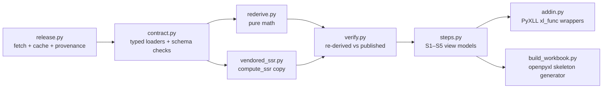

# Technical Design — pyxll-factor-workbook

## Overview

**Purpose**: This feature delivers an Excel-native, step-by-step audit view of the completed
factor-scoring assessment to reviewers who work in Excel rather than Jupyter.
**Users**: The project owner and any reviewer walk the five-step storyboard (model screen →
coin-flip → factor development → two-line simulation → luck-vs-skill), drilling from every
headline figure down to the raw per-prompt evidence, with re-derivations computed in front of them.
**Impact**: Purely additive. The workbook consumes the published `data-v1` GitHub Release
(read-only, by URL); nothing in the existing repo, specs, notebooks, or data changes.

### Goals
- Load all 27 `data-v1` release assets by URL with visible provenance and explicit versioning (R1).
- Present S1–S5 as navigable sheets whose headline figures are re-derived live from granular
  tables, with discrepancies flagged (R2–R6, R7.2).
- Keep 100% of data/computation logic testable on the Linux dev box; isolate the Excel-only
  surface to one thin wrapper module plus a generated workbook skeleton (R7.4).

### Non-Goals
- No model inference, scoring runs, or data production (R7.1); no publishing of future releases.
- No automated Excel UI testing; live Excel behavior is verified by a manual Windows checklist.
- No streaming/ticking data (RTD deferred); no write-back of any kind to the release.

## Boundary Commitments

### This Spec Owns
- The `workbook/` source tree: release client, schema-contract loaders, re-derivation math,
  verification (discrepancy) framework, step assembly, PyXLL wrapper module, workbook-skeleton
  generator, its tests and README.
- The workbook-side interpretation contract: how each release asset maps to sheets, and the
  re-derivation formulas displayed to reviewers.
- The `pyxll.cfg.example` and Windows-deployment documentation (R7.6).

### Out of Boundary
- The `data-v1` release content, naming, and future releases — owned by
  `version-aware-factor-scoring`. The workbook treats asset names/schemas as an upstream contract.
- `macro_framework`, notebooks 01–14, and all committed data artifacts — never modified.
- recall_guard and any NIM/LLM interaction — the workbook never holds an inference credential.
- Filling the maverick raw-evidence gap — upstream duty; the workbook renders it as "pending".

### Allowed Dependencies
- Runtime (lean surface): `pandas`, `pyarrow`, `requests`, `pyxll` (PyPI stub; real add-in only
  in Excel), `openpyxl` (skeleton generation). Optional extras: `keyring` (token, dormant),
  `scikit-learn` (full certification re-derivation only).
- The GitHub Release asset URL contract
  `https://github.com/norandom/Global_Macro_AI_Factors/releases/download/<tag>/<asset>`.
- NOT allowed: importing `macro_framework` or `recall_guard` from workbook code (vendor instead);
  any dependency that requires compilation on the Excel machine (numba/vectorbt class).

### Revalidation Triggers
- Any change to release asset names, schemas, or the tag naming scheme (upstream data-v2+) →
  re-run the contract tests before adopting the new tag.
- Repo visibility change (public → private) → activate and verify the token path (R1.3).
- PyXLL major-version upgrade → re-verify stub pass-through behavior and async UDF semantics.
- Vendored `compute_ssr` diverging from `macro_framework/ssr.py` → re-sync and re-run parity test.

## Architecture

### Architecture Pattern & Boundary Map

Layered pipeline, strict left-to-right imports (violations are errors):



**Key decisions**
- *One source tree, two install surfaces*: the package lives in-repo and is collected by the
  repo's root `uv run pytest` (root env is a superset); `workbook/pyproject.toml` defines the
  lean pip-installable surface for the Windows Excel machine. No heavy dep ever reaches Excel.
- *Generated presentation*: `build_workbook.py` (Linux-runnable, openpyxl) emits the five-sheet
  skeleton — labels, framing text, `=FW_*()` formulas. PyXLL evaluates those functions live in
  Excel. The manual Windows checklist shrinks to type conversion + async behavior.
- *Vendoring over importing*: `compute_ssr` copied verbatim with a provenance header; a parity
  test asserts vendored output equals `macro_framework.ssr` output on the released equity data
  (runs only in the root env where both exist).
- *Schema contract = discrepancy foundation*: loaders validate columns/dtypes/index/row-counts
  captured in research.md §1 and fail fast with asset+column-specific messages.

### Technology Stack

| Layer | Choice / Version | Role in Feature | Notes |
|-------|------------------|-----------------|-------|
| Excel add-in | PyXLL 5.12.x (commercial, Windows) | Live worksheet functions | PyPI `pyxll` stub for dev/tests on Linux |
| Core runtime | Python 3.12; pandas, pyarrow, requests | fetch/parse/re-derive | matches repo pin |
| Presentation build | openpyxl | generate workbook skeleton on Linux | new lean dep |
| Optional extras | keyring; scikit-learn | dormant token path; full certification re-derive | extras in `workbook/pyproject.toml` |
| Tests | pytest via root `uv run pytest` | offline, fixture-driven | R7.4 |

## File Structure Plan

### Directory Structure
```
workbook/
├── pyproject.toml            # lean install surface (deps above; extras: keyring, sklearn)
├── README.md                 # install, pyxll.cfg setup, license/trial prerequisite (R7.6)
├── pyxll.cfg.example         # modules=factor_workbook.addin; pythonpath notes
├── build_workbook.py         # openpyxl generator → factor_workbook.xlsx (5 sheets + nav index)
├── factor_workbook/
│   ├── __init__.py           # version + public re-exports (no heavy work at import)
│   ├── release.py            # ReleaseClient: versioned fetch, disk cache, tar.gz unpack,
│   │                         #   provenance records, dormant token path (R1)
│   ├── contract.py           # ASSET_SPECS registry + typed loaders + schema validation (R1.4, R7.2 base)
│   ├── rederive.py           # wilson_ci, guarded_tilt, paired_cohens_d, contamination_premium,
│   │                         #   loading_stability, equity_metrics (+crisis window), evidence_class_stats
│   ├── vendored_ssr.py       # verbatim compute_ssr/SSRResult copy + provenance header (R6.2)
│   ├── certification.py      # OPTIONAL (sklearn extra): vendored certification_stats re-derivation (R2.6 deepening)
│   ├── verify.py             # Check dataclass + compare(published, rederived, tol) → flags (R7.2)
│   ├── steps.py              # build_s1()..build_s5(): typed view models per storyboard step,
│   │                         #   framing strings (R2.2, R3.3, R5.2, R6.3, R7.3), gap markers (R2.4/2.5)
│   └── addin.py              # thin @xl_func wrappers: async loads → object-cache handles,
│   │                         #   per-table expanders, provenance/version functions (R1.2, R1.5)
└── tests/
    ├── fixtures/             # small recorded copies of release assets (schema-true subsets)
    ├── test_release.py       # fetch/cache/unpack/provenance/error-states; token path unit
    ├── test_contract.py      # every ASSET_SPEC vs fixture; corrupted-schema failure messages
    ├── test_rederive.py      # each formula vs hand-computed values + against fixture published values
    ├── test_verify.py        # agreement → no flag; injected discrepancy → flag (R7.2)
    ├── test_steps.py         # S1–S5 view models incl. framing text, maverick "pending", unscreenable
    ├── test_addin.py         # wrappers importable + callable on Linux via pyxll stub
    ├── test_build_workbook.py# generated xlsx: 5 sheets, formulas reference existing FW_* functions
    └── test_parity_root_env.py # vendored compute_ssr == macro_framework.ssr on real data (skipped outside root env)
```

### Modified Files
- Root `pyproject.toml` — add `pyxll` + `openpyxl` to the dev dependency group only (so root
  pytest can import the wrappers and generator). No runtime dependency changes.
- `.gitignore` — workbook build/cache outputs (`workbook/.cache/`, generated `.xlsx` if not shipped).

## Components & Interfaces

| Component | Domain | Intent | Requirements | Depends on | Contract |
|---|---|---|---|---|---|
| ReleaseClient | data access | versioned, cached, provenance-tracked asset retrieval | 1.1–1.6 | requests | Service |
| contract loaders | data access | schema-validated typed frames per asset | 1.4, 2.x–6.x inputs | ReleaseClient | Service |
| rederive | computation | pure re-derivation formulas | 2.6, 3.2, 4.3, 6.1, 5.3 | pandas/numpy | Service |
| vendored_ssr | computation | SSR/HAC re-derivation | 6.2 | numpy/pandas | Service |
| certification (extra) | computation | full AUC/CI/perm-p re-derivation | 2.6 deepening | sklearn | Service |
| verify | integrity | published-vs-rederived comparison flags | 7.2 | rederive outputs | Service |
| steps | presentation model | S1–S5 typed view models + framing + gap markers | 2.x–6.x, 7.3 | all above | Service |
| addin | Excel surface | @xl_func wrappers, async loads, expanders | 1.2, 1.5, 7.4 | steps | API (UDF) |
| build_workbook | presentation build | openpyxl skeleton generator | 7.4, navigation | steps (names only) | Batch |

### ReleaseClient (`release.py`)

```python
@dataclass(frozen=True)
class Provenance:
    tag: str                 # e.g. "data-v1"
    asset: str               # release asset name
    url: str                 # resolved download URL
    fetched_at: str          # ISO timestamp
    sha256: str              # of the downloaded bytes
    from_cache: bool

@dataclass(frozen=True)
class FetchError:
    asset: str
    cause: str               # "network" | "missing" | "auth" | "unpack"
    detail: str

class ReleaseClient:
    def __init__(self, tag: str, cache_dir: Path | None = None,
                 token_provider: Callable[[], str | None] | None = None) -> None: ...
    def fetch(self, asset: str) -> tuple[bytes, Provenance]: ...      # raises ReleaseError(FetchError)
    def fetch_tar_member(self, asset: str, member: str) -> tuple[bytes, Provenance]: ...
    def provenance_table(self) -> list[Provenance]: ...               # everything loaded so far (R1.2)
```
- Pre/post: `fetch` never substitutes stale data on failure — cache is keyed by (tag, asset,
  upstream ETag/sha) and a failed refresh raises rather than silently serving cache (R1.4);
  `tag` is immutable per client — switching versions constructs a new client (R1.5).
- Token path (dormant): `token_provider` defaults to keyring→env lookup and is consulted only on
  403/404 from the unauthenticated URL; tokens never appear in provenance or errors (R1.3).

### Contract loaders (`contract.py`)

```python
@dataclass(frozen=True)
class AssetSpec:
    asset: str                              # release asset name
    kind: Literal["parquet", "json", "tar_parquet", "tar_json"]
    index: str | None                       # expected index name
    columns: dict[str, str]                 # column -> dtype
    min_rows: int

ASSET_SPECS: dict[str, AssetSpec]           # one entry per consumed asset (research.md §1)

def load_frame(client: ReleaseClient, key: str) -> tuple[pd.DataFrame, Provenance]: ...
def load_json(client: ReleaseClient, key: str) -> tuple[dict, Provenance]: ...
# raises SchemaError("asset X: missing column Y (expected dtype Z)") — fail fast (R1.4)
```

### Re-derivation (`rederive.py`) — all pure, all typed

```python
def wilson_ci(successes: int, n: int, z: float = 1.96) -> tuple[float, float]
def guarded_tilt(raw: pd.Series, p_mem: pd.Series) -> pd.Series          # raw*(1-clip(p,0,1))
def paired_cohens_d(deltas: pd.Series) -> float
def contamination_premium(pit: pd.Series, nonpit: pd.Series) -> PremiumResult
def loading_stability(loadings: pd.DataFrame, parse_ok: pd.Series) -> dict[str, float]
def equity_metrics(value: pd.Series, crisis: tuple[str, str] = ("2022-01-01","2022-12-31")) -> EquityMetrics
def evidence_class_stats(evidence: pd.DataFrame) -> ClassStats            # counts + std_* summaries (R2.6)
```

### Verification (`verify.py`)

```python
@dataclass(frozen=True)
class Check:
    name: str            # e.g. "S3 guarded_tilt equals raw*(1-p)"
    published: float
    rederived: float
    tolerance: float     # display precision, default 1e-6 relative
    ok: bool
    message: str         # human-readable, shown in the sheet when not ok

def compare(name: str, published: float, rederived: float, *, tol: float = 1e-6) -> Check
```
- Post-condition: a failed check is returned and displayed, never raised and never resolved
  silently in favor of either value (R7.2).

### Steps (`steps.py`)

One builder per storyboard step, returning a typed view model that owns its framing text:

```python
@dataclass(frozen=True)
class StepView:
    title: str
    framing: str                      # the mandated language (R2.2/R3.3/R6.3/R7.3)
    tables: dict[str, pd.DataFrame]   # named tables for the sheet
    checks: list[Check]               # verification rows displayed with the step

def build_s1(client) -> StepView     # certification table + per-candidate evidence + gap markers
def build_s2(client) -> StepView     # naive eval + Wilson CI check
def build_s3(client) -> StepView     # loadings/scores/views + guard check + stability + gate
def build_s4(client) -> StepView     # two lines: equity/targets/decision + labels (R5.2)
def build_s5(client) -> StepView     # contrast + premium/effect-size checks + SSR table (+ PIT-vs-nonPIT loading stability, research.md §5)
```
- S1 renders maverick with `raw evidence pending` (R2.4) and llama-3.3-70b as
  `unscreenable — not exonerated` (R2.5), sourced from `results.json` verdicts vs available
  evidence dirs; never throws on the known gap.

### Excel surface (`addin.py`) — thin, stub-safe

```python
@xl_func("string tag: object", name="FW_LOAD")
async def fw_load(tag: str) -> object            # ReleaseClient handle (object cache)
@xl_func("object client, string step: object", name="FW_STEP")
async def fw_step(client, step: str) -> object   # StepView handle
@xl_func("object step_view, string table: dataframe<index=True>", name="FW_TABLE")
def fw_table(step_view, table: str) -> pd.DataFrame
@xl_func("object step_view: dataframe<index=True>", name="FW_CHECKS")
def fw_checks(step_view) -> pd.DataFrame          # verification flags (R7.2 visible)
@xl_func("object client: dataframe<index=True>", name="FW_PROVENANCE")
def fw_provenance(client) -> pd.DataFrame         # R1.2
```
- Async loads keep Excel's UI live; tables are expanded on demand from object-cache handles.
- No UDF accepts a token argument (R1.3). Version change = user edits the tag cell feeding
  `FW_LOAD` — explicit, visible, reload-everything semantics (R1.5).

## Error Handling
- Retrieval: per-asset `FetchError` surfaces in-sheet as `#ERROR: <asset>: <cause>` via the
  wrapper's error string; no partial/stale substitution (R1.4).
- Schema: `SchemaError` names asset + column + expected dtype; treated as a contract breach
  (revalidation trigger), not a display problem.
- Verification: disagreements are data, not exceptions — rendered as flag rows (R7.2).
- Known upstream gaps: modeled as explicit view-model states (`pending`, `unscreenable`), never
  exceptions (R2.4, R2.5).

## Testing Strategy
- **Unit (Linux, offline)**: every `rederive` formula against hand-computed values AND against
  the published values in fixtures (R2.6, R3.2, R4.3, R6.1); `verify.compare` flags an injected
  discrepancy and passes on agreement (R7.2); `ReleaseClient` error taxonomy incl. the
  no-stale-substitution rule (R1.4) and the dormant token lookup order (R1.3).
- **Contract (Linux, offline)**: all `ASSET_SPECS` validate against fixture assets; corrupted
  fixtures produce asset+column-specific failures (R1.4).
- **Step views (Linux, offline)**: S1 gap markers (R2.4/2.5); mandated framing strings present
  verbatim in S2/S4/S5 views (R3.3, R5.2, R6.3, R7.3); S4 labels the diagnostic line.
- **Excel-surface smoke (Linux)**: `addin.py` imports under the PyPI stub; every `FW_*` callable
  with fixture data (R7.4); generated workbook contains 5 sheets whose formulas reference only
  existing `FW_*` names.
- **Parity (root env only)**: vendored `compute_ssr` output equals `macro_framework.ssr` on the
  real released equity series; auto-skipped in the lean env.
- **Network integration (opt-in marker)**: one test fetches a real `data-v1` asset end-to-end;
  excluded from default runs.
- **Manual Windows checklist (documented in README)**: add-in loads via `pyxll.cfg`; async load
  fills cells without freezing UI; dataframe spill; provenance sheet populates (R7.6).

## Requirements Traceability

| Req | Components | Interfaces |
|---|---|---|
| 1.1, 1.2, 1.3, 1.4, 1.5, 1.6 | ReleaseClient, addin | `fetch` (1.1, 1.4, 1.6 read-only), `provenance_table`/`FW_PROVENANCE` (1.2), `token_provider` (1.3), `FW_LOAD` tag-cell semantics (1.5) |
| 2.1, 2.2, 2.3, 2.4, 2.5, 2.6 | contract, rederive, certification (extra), steps | `build_s1` (2.1 table, 2.2 framing, 2.3 drill-down, 2.4 pending, 2.5 unscreenable), `evidence_class_stats` (2.6) |
| 3.1, 3.2, 3.3 | rederive, steps | `build_s2` (3.1 per-call table, 3.3 framing), `wilson_ci` (3.2) |
| 4.1, 4.2, 4.3, 4.4, 4.5 | rederive, steps | `build_s3` (4.1 loadings+parse, 4.2 scores+distribution, 4.5 gate view), `guarded_tilt` (4.3), `loading_stability` (4.4) |
| 5.1, 5.2, 5.3, 5.4 | rederive, steps | `build_s4` (5.1 two lines, 5.2 labels, 5.4 per-date detail), `equity_metrics` (5.3 head-to-head recompute) |
| 6.1, 6.2, 6.3 | rederive, vendored_ssr, steps | `contamination_premium`/`paired_cohens_d` (6.1), `compute_ssr` (6.2), `build_s5` framing (6.3) |
| 7.1, 7.2, 7.3, 7.4, 7.5, 7.6 | verify, all layers, tests, README | no-inference layering + Allowed Dependencies (7.1), `compare`/`FW_CHECKS` (7.2), StepView framing ownership (7.3), stub-based Linux tests (7.4), additive file plan — new `workbook/` dir only (7.5), README prerequisites (7.6) |
