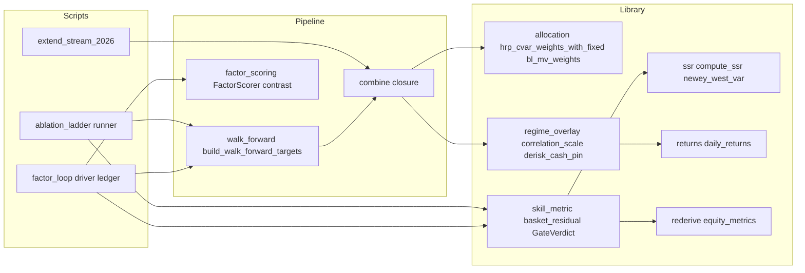
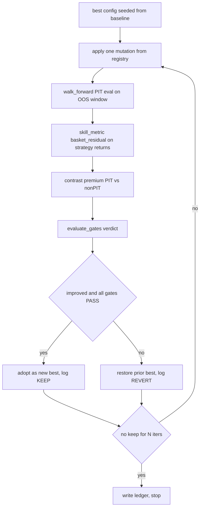

# Design Document — regime-steered-ai-factors

## Overview

**Purpose.** This feature delivers a metric-driven research apparatus for deriving a *measurably better* AI macro factor to steer the HRP-CVaR + Black-Litterman monthly rebalance, and a non-LLM regime de-risk control against which any AI factor must prove itself. The value is a mechanical, point-in-time, no-recall verdict — "did this change add genuine timing skill?" — and an automated loop that accumulates only changes that pass it.

**Users.** The quant researcher/PM operating the `factor_scoring` walk-forward pipeline. They run the loop to search the mutation space, read the ablation ladder and per-iteration ledger, and consult the regime overlay as a falsification bar.

**Impact.** Adds two small library modules (`skill_metric`, `regime_overlay`) and two thin driver scripts (`factor_loop`, `ablation_ladder`) on top of the existing walk-forward, contrast, and reproducibility machinery. It introduces one optional, flag-gated hook in the existing `combine` weight closure. It does **not** modify `allocation.py`, the recall guard, or any published artifact.

### Goals
- A reusable, HAC-corrected **own-basket appraisal ratio** harness (the skill metric) and a single PASS/FAIL **gate verdict**.
- An **ablation ladder** scoring HRP-only → +BL(fixed) → +BL(AI-PIT) → +BL(AI-non-PIT) on that metric over one out-of-sample window.
- An **iterate-verify-keep `/loop`** with an auditable ledger, enforcing PIT and the gates, loop-until-dry.
- A **walk-forward-fit regime de-risk overlay** (correlation-based) as a non-LLM control leg, plugging into the existing cash-pin.

### Non-Goals
- Changing `recall_guard` internals or the PIT slicing contract (consumed, not owned).
- Expanding the asset universe beyond the four ETFs, or re-selecting the universe (known separate issue).
- VIX-based and Sparse-Jump-Model regime variants — deferred (VIX needs `VIXCLS` ingestion; SJM needs a refit wrapper). The correlation overlay is the v1 control.
- Refactoring `scripts/build_tear_sheet.py` to call the new harness (dedupe deferred to avoid disturbing published tear-sheet outputs).
- Live production trading; selecting/training a different LLM.

## Boundary Commitments

### This Spec Owns
- The own-basket skill metric and its HAC t-statistic (`macro_framework/skill_metric.py`).
- The gate verdict (skill-t, SSR, recall-premium, risk-shape) and its configuration.
- The correlation de-risk overlay and the mapping from a stress signal to a dynamic cash pin (`macro_framework/regime_overlay.py`).
- The loop driver, its mutation registry, and the ledger artifact (`scripts/factor_loop.py`, `factor_loop_ledger_*.json`).
- The ablation-ladder runner and its artifact (`scripts/ablation_ladder.py`).

### Out of Boundary
- PIT enforcement mechanics (owned by `walk_forward.build_walk_forward_targets`).
- `p_memorized` scoring, the PIT/non-PIT contrast, and certification (owned by `factor_scoring.FactorScorer` / `run_pit_vs_nonpit_contrast` / `certification_stats`).
- HRP-CVaR and BL weight math (owned by `allocation.py`); the overlay only *supplies* a `fixed_weights` value.
- Published `_v1/_v2/_ext2026` artifacts (never overwritten).

### Allowed Dependencies
- Library-tier: `macro_framework.ssr`, `returns`, `allocation`, `evaluation`, `backtest`; `workbook.factor_workbook.rederive` (`equity_metrics`).
- Pipeline-tier (scripts only): `walk_forward`, `factor_scoring`, `steering`, `llm_agent`, the `extend_stream_2026` replay/driver patterns.
- External: `statsmodels` (new direct dep, HAC regression), `riskfolio-lib`, `scipy`, `numpy`, `pandas` (existing).
- Constraint: new **library** modules import only from library-tier + external; they must not import scripts or pipeline-tier. Scripts may import everything.

### Revalidation Triggers
- Change to the `walk_forward` context contract (`ctx["returns"]`, strictly-before slicing) → re-check overlay PIT cleanliness and loop verify.
- Change to `ContrastResult.contamination_premium()` shape → re-check the recall gate.
- Change to `hrp_cvar_weights_with_fixed` signature or the `combine` closure → re-check the overlay hook.
- Change to the artifact registry (`contract.AssetSpec`) → re-check ledger/ablation artifact schemas.

## Architecture

### Existing Architecture Analysis
The repository is layered: pure library (`macro_framework/*` + `workbook/factor_workbook/rederive.py`) → pipeline (`walk_forward`, `factor_scoring`, `steering`) → scripts (`extend_stream_2026.py`). PIT is enforced structurally in `walk_forward` (every slice strictly before the rebalance date). The AI view flows `render_regime_loadings_prompt → parse_loadings → loadings_to_tilt_views → recall_guarded_adjust → views_to_bl → combine` (0.7 HRP / 0.3 BL). The no-recall evidence already exists as `ContrastResult.contamination_premium()`. Reproducibility is by additive versioned filenames, `run_header.json`, decision logs, and schema-validated artifacts. This design extends at three seams and adds no new layer.

### Architecture Pattern & Boundary Map



**Selected pattern:** layered extension. New library units (`skill_metric`, `regime_overlay`) sit beside existing library modules; new scripts orchestrate. **Dependency direction:** `Library → Pipeline → Scripts`; library imports leftward only. **New components rationale:** the skill metric and overlay are new *responsibilities* (skill measurement; stress-scaling) not present anywhere; the loop is a new *orchestration* not appropriate inside a one-shot script.

### Technology Stack

| Layer | Choice / Version | Role in Feature | Notes |
|-------|------------------|-----------------|-------|
| Library / Stats | `statsmodels` (new direct dep; already transitively present) | HAC (Newey-West) regression t-stat on own-basket α | nb05 attribution already uses `OLS(...).fit(cov_type="HAC")` |
| Library / Stats | `macro_framework.ssr` (existing) | SSR gate + `newey_west_var` HAC estimator | no new dep |
| Data / Alloc | `riskfolio-lib>=7.2.1` (existing) | HRP-CVaR + BL weights (unchanged) | via `allocation.py` |
| Data / Storage | parquet + JSON under `data/` (existing) | ledger, ablation, metric artifacts | additive, versioned |

## File Structure Plan

### New Files
```
macro_framework/
├── skill_metric.py        # own-basket appraisal ratio (HAC) + GateVerdict + evaluate_gates
└── regime_overlay.py      # ported correlation_scale family + derisk_cash_pin

scripts/
├── factor_loop.py         # /loop driver: mutation registry, verify, keep/revert, ledger, loop-until-dry
└── ablation_ladder.py     # runs the 4 rungs through skill_metric on one OOS window

tests/
├── test_skill_metric.py   # metric math + gate verdict truth table
└── test_regime_overlay.py # correlation scale monotonicity + PIT-cleanliness + cash-pin bounds
```

### Modified Files
- `scripts/extend_stream_2026.py` — the `combine` closure (extend_stream_2026.py:627) gains an **optional** `regime_overlay` parameter that, when supplied, replaces the constant `{"BIL":0.25}` with `derisk_cash_pin(ctx["returns"])`. Default `None` preserves byte-identical published behavior.
- `macro_framework/__init__.py` — export `skill_metric`, `regime_overlay` symbols.
- `pyproject.toml` — add `statsmodels` to direct dependencies.

## System Flows

### The iterate-verify-keep loop (R5)



Gating conditions: a mutation is adopted only if the own-basket appraisal *improves* over the current best **and** every gate passes. Cache discipline: cache-reusing mutations (blend, τ, overlay, exposure table) reuse persisted scores via the `_ReplayScorer` pattern; only re-scoring mutations (prompt, axes, factor set) trigger live NIM calls.

### The de-risk overlay at the weight seam (R6)


The overlay computes a dynamic BIL pin from the strictly-pre-rebalance return window, so it is PIT-clean by construction. A higher pin shrinks the risky HRP sleeve by `(1 - bil_pin)` and routes the remainder to cash — no `allocation.py` change.

## Requirements Traceability

| Requirement | Summary | Components | Interfaces | Flows |
|-------------|---------|------------|------------|-------|
| 1.1–1.5 | Own-basket appraisal ratio + HAC t + guards | `skill_metric` | `basket_residual` | de-risk N/A; used in loop/ablation |
| 2.1–2.6 | Gate verdict, PASS/FAIL, thresholds | `skill_metric` | `GateVerdict`, `evaluate_gates`, `GateConfig` | Loop gating |
| 3.1–3.5 | PIT / no-recall; OOS-only; reject look-ahead | `walk_forward` (existing) + `factor_loop` | `ctx` slicing; `LoopConfig.oos_window`; look-ahead reject/log | Loop verify |
| 4.1–4.4 | Ablation ladder scored on the metric | `ablation_ladder` | `run_ablation` | — |
| 5.1–5.6 | One-mutation loop, keep/revert, ledger, loop-until-dry | `factor_loop` | `run_loop`, `Mutation`, `LedgerEntry` | Loop |
| 6.1–6.6 | Correlation de-risk overlay; control leg; walk-forward-fit | `regime_overlay` + `combine` hook | `correlation_scale`, `derisk_cash_pin` | De-risk seam |
| 7.1–7.4 | Regime-conditioned AI view, gated | `factor_loop` mutation + prompt lever | `Mutation regime_view`; gated by `GateVerdict` | Loop |
| 8.1–8.5 | Conventions, reuse, determinism, additive artifacts | all scripts | `run_header` + ledger schema | — |

## Components and Interfaces

| Component | Layer | Intent | Req Coverage | Key Dependencies | Contracts |
|-----------|-------|--------|--------------|------------------|-----------|
| `skill_metric` | Library | Skill metric + gate verdict | 1, 2 | `ssr` (P0), `statsmodels` (P0), `rederive` (P1) | Service, State |
| `regime_overlay` | Library | Correlation de-risk scale → cash pin | 6 | `returns` (P1) | Service |
| `factor_loop` | Script | Iterate-verify-keep driver + ledger | 3, 5, 7 | `walk_forward` (P0), `skill_metric` (P0), `factor_scoring` (P0) | Batch, State |
| `ablation_ladder` | Script | Score the four rungs | 4 | `walk_forward` (P0), `skill_metric` (P0) | Batch |

### Library

#### skill_metric

| Field | Detail |
|-------|--------|
| Intent | Compute the own-basket appraisal ratio (HAC) and the composite gate verdict |
| Requirements | 1.1, 1.2, 1.3, 1.4, 1.5, 2.1, 2.2, 2.3, 2.4, 2.5, 2.6 |

**Responsibilities & Constraints**
- Regress strategy daily returns on the four **own-factor** ETF returns with a constant beta over the window; α is annualized, its t-stat uses a Newey-West HAC covariance (`cov_type="HAC"`). Isolates timing skill from static factor exposure (1.1, 1.2, 1.3).
- Where a market benchmark is provided, also report single-factor market α/β/R² (1.4).
- Return the appraisal ratio as `None` when residual volatility is below `IDIO_FLOOR` (1.5).
- Compose the four gates into one verdict; report the failing gate and missed value (2.1, 2.6). Gate thresholds are configurable; defaults encode the requirement (`skill_t_min=2.0`, `ssr_min=1.96`), with an alternative `relative_improvement` mode (see Open Questions).

**Dependencies**
- Outbound: `ssr.compute_ssr`, `ssr.newey_west_var` — SSR gate + HAC estimator (P0).
- External: `statsmodels.api.OLS(...).fit(cov_type="HAC")` — HAC coefficient t-stat (P0).
- Outbound: `rederive.equity_metrics` — Calmar/max-drawdown for the risk-shape gate (P1).

**Contracts**: Service [x] / State [x]

##### Service Interface
```python
from dataclasses import dataclass
from typing import Literal

IDIO_FLOOR: float = 1e-4  # annualized residual-vol floor below which appraisal is undefined

@dataclass(frozen=True)
class BasketResidual:
    alpha_ann: float
    t_alpha_hac: float
    r2: float
    idio_vol_ann: float
    appraisal: float | None          # alpha_ann / idio_vol_ann, or None if idio < IDIO_FLOOR
    n_obs: int
    hac_maxlags: int

def basket_residual(
    strategy_returns: "pd.Series",
    factor_returns: "pd.DataFrame",   # own 4-ETF daily returns, aligned/inner-joined
    *,
    periods_per_year: int = 252,
    hac_maxlags: int = 5,
) -> BasketResidual: ...

@dataclass(frozen=True)
class MarketAttribution:
    alpha_ann: float
    beta: float
    r2: float

def market_attribution(
    strategy_returns: "pd.Series", market_returns: "pd.Series",
    *, periods_per_year: int = 252, hac_maxlags: int = 5,
) -> MarketAttribution: ...

@dataclass(frozen=True)
class GateConfig:
    skill_t_min: float = 2.0
    ssr_min: float = 1.96
    recall_premium_max: float = 0.05      # |PIT vs non-PIT p_memorized delta| tolerance (~0)
    calmar_tolerance: float = 0.0         # OOS Calmar must be >= baseline - tolerance
    maxdd_tolerance: float = 0.0          # OOS |maxDD| must be <= baseline |maxDD| + tolerance
    mode: Literal["absolute", "relative_improvement"] = "absolute"

@dataclass(frozen=True)
class GateVerdict:
    passed: bool
    skill_pass: bool
    stability_pass: bool
    recall_pass: bool
    risk_shape_pass: bool
    first_failure: str | None            # e.g. "stability: SSR=0.14 < 1.96"
    values: dict[str, float]

def evaluate_gates(
    residual: BasketResidual,
    ssr: "SSRResult",
    recall_premium: float,               # from ContrastResult.contamination_premium()
    oos_calmar: float, baseline_calmar: float,
    oos_maxdd: float, baseline_maxdd: float,
    *, config: GateConfig = GateConfig(),
) -> GateVerdict: ...
```
- Preconditions: `strategy_returns` and `factor_returns` share a joinable daily index; ≥ `MIN_OBS` overlapping rows.
- Postconditions: `BasketResidual.appraisal is None` iff `idio_vol_ann < IDIO_FLOOR`; `GateVerdict.passed` iff all four sub-gates pass under `config.mode`.
- Invariants: pure and deterministic; no IO; equal inputs → equal output.

**Implementation Notes**
- Integration: consumes strategy returns produced by the walk-forward sim; `factor_returns` = `returns.daily_returns(get_prices(BASKET))`.
- Validation: constant-beta static-exposure regression (not contemporaneous dynamic weights) so timing appears in the residual.
- Risks: near-collinear basket → R²≈0.98, tiny residual (see Open Questions 1); handled by the `IDIO_FLOOR` guard and the relative-improvement gate mode.

#### regime_overlay

| Field | Detail |
|-------|--------|
| Intent | Map a point-in-time stress signal to a de-risk cash pin |
| Requirements | 6.1, 6.2, 6.3, 6.4, 6.6 |

**Responsibilities & Constraints**
- Compute an EWMA average pairwise correlation across the risky sleeve and a continuous de-risk scale in `[min_scale, 1.0]` (ported from facdrone, pure numpy/pandas) (6.3, 6.6).
- Convert the scale to a BIL pin that only *raises* cash in stress and never lifts risky above its no-overlay level (6.1, 6.2).

**Dependencies**
- Outbound: `returns.daily_returns` / the `ctx["returns"]` frame (P1). No `allocation.py` dependency (the pin is passed to the existing `fixed_weights` arg).

**Contracts**: Service [x]

##### Service Interface
```python
def ewma_correlation_matrix(returns: "pd.DataFrame", halflife: int = 10) -> "pd.DataFrame": ...
def avg_pairwise_correlation(returns: "pd.DataFrame", halflife: int = 10) -> float: ...
def correlation_scale(
    returns: "pd.DataFrame", *, halflife: int = 10,
    normal_corr: float = 0.30, crisis_corr: float = 0.70, min_scale: float = 0.20,
) -> float: ...  # continuous dampener in [min_scale, 1.0]

def derisk_cash_pin(
    returns_hist: "pd.DataFrame",           # ctx["returns"], strictly pre-rebalance
    *, base_risky_symbols: tuple[str, ...],
    base_cash_pin: float = 0.25, min_scale: float = 0.20,
) -> float:
    """bil_pin = 1 - scale * (1 - base_cash_pin); scale from correlation_scale over risky cols.
    Guaranteed in [base_cash_pin, 1) so hrp_cvar_weights_with_fixed's sum<1 guard holds."""
```
- Preconditions: `returns_hist` contains the risky sleeve columns; ≥ `halflife` rows.
- Postconditions: `base_cash_pin <= derisk_cash_pin(...) < 1.0`; monotonically non-decreasing in measured correlation.
- Invariants: PIT-clean (reads only `returns_hist`); pure/deterministic.

### Scripts

#### factor_loop

| Field | Detail |
|-------|--------|
| Intent | Drive iterate-verify-keep with a ledger; enforce PIT and gates |
| Requirements | 3.1, 3.2, 3.3, 3.4, 3.5, 5.1, 5.2, 5.3, 5.4, 5.5, 5.6, 7.1, 7.2, 7.3, 7.4 |

**Responsibilities & Constraints**
- Hold a best-configuration state; apply exactly one mutation per iteration (5.1); verify on the OOS PIT window (5.2, 3.1, 3.4); adopt iff improved and all gates pass, else revert (5.3, 5.4); stop after `dry_rounds` with no adoption (5.5); append a `LedgerEntry` every iteration (5.6).
- Reject-and-log any mutation whose component would need post-decision information (3.3); never rank on in-sample Sharpe (3.5).
- The regime-conditioned AI view (R7) is one mutation kind, subject to the same gates (7.2); bounded within the existing HRP/BL blend (7.4); not recommended unless it beats both the control and the unconditioned view (7.3).

**Contracts**: Batch [x] / State [x]

##### Batch / Job Contract
- Trigger: `uv run python scripts/factor_loop.py [--config ...]` or the `/loop` skill self-paced.
- Input/validation: `LoopConfig` (OOS window disjoint from `CUTOFF`; mutation registry; `dry_rounds`; `GateConfig`). Fail-fast on an OOS window overlapping any tuning window.
- Output/destination: `data/factor_loop_ledger_<runid>.json` (+ csv mirror); best-config snapshot.
- Idempotency & recovery: deterministic given seed and cached scores; resumable from the last ledger entry.

##### State Management
```python
@dataclass(frozen=True)
class Mutation:
    kind: str            # "blend" | "tau" | "conviction" | "exposure" | "prompt" | "axes" | "overlay" | "regime_view"
    param: str
    value: object
    rescoring: bool      # True → live NIM calls; False → reuse persisted scores

@dataclass(frozen=True)
class LedgerEntry:
    iteration: int
    mutation: Mutation
    appraisal: float | None
    verdict: GateVerdict
    decision: Literal["KEEP", "REVERT"]

def run_loop(config: "LoopConfig") -> list[LedgerEntry]: ...
```
- State model: single mutable "best config"; append-only ledger.
- Concurrency: single-writer; cache-reusing mutations may batch-evaluate.

**Implementation Notes**
- Integration: reuses `build_walk_forward_targets`, the `combine` closure (with optional overlay), `_ReplayScorer` caching, and `run_pit_vs_nonpit_contrast` for the recall gate.
- Validation: assert OOS window disjointness; assert one mutation per iteration.
- Risks: live-NIM cost/latency on re-scoring mutations (Open Questions 2); mitigated by cache-first sequencing.

#### ablation_ladder

Summary-only. Runs HRP-only, HRP+BL(fixed), HRP+BL(AI-PIT), HRP+BL(AI-non-PIT-diagnostic) over one OOS window via existing lines, scores each with `skill_metric`, and reports the AI-view marginal delta (4.1–4.3). Labels the non-PIT rung diagnostic-only and excludes it from any recommendation (4.4). Output: `data/factor_ablation_<runid>.json` (+ csv mirror). Batch contract mirrors `factor_loop`.

## Data Models

**Ledger artifact** (`factor_loop_ledger_<runid>.json`): `{ run_header: {...}, config: {...}, entries: [LedgerEntry...], best_config: {...} }`, written `sort_keys=True`, additive filename, never overwriting `_v1/_v2/_ext2026`. Schema registered via `contract.AssetSpec` so it is validated on read (8.3, 8.5).

**Run header** reuses the existing `run_header.json` convention (nim_model, cutoff_date, oos_window, seed, built_at) plus a `gate_config` block (8.1).

## Error Handling

### Error Strategy
- **Fail-fast (config errors):** OOS window overlapping a tuning/cutoff window, non-joinable return frames, or empty basket → raise `ConfigurationError` before any iteration (mirrors `factor_scoring.ConfigurationError`).
- **Look-ahead rejection (3.3):** a mutation/component requiring post-decision data → skip, record `decision="REVERT"` with `first_failure="lookahead: <reason>"`, continue the loop.
- **Undefined metric (1.5):** residual below `IDIO_FLOOR` → `appraisal=None`, the skill gate fails cleanly rather than dividing by ~0.
- **Degenerate gate inputs:** SSR undefined (too few rolling points) or missing baseline → gate fails with an explicit `first_failure`, never a silent pass.

### Monitoring
Per-iteration ledger is the audit log; each entry records mutation, metric values, gate outcomes, and the keep/revert decision. The loop prints a one-line progress record per iteration (iteration, mutation, appraisal, verdict, decision).

## Testing Strategy

### Unit Tests
- `basket_residual`: on a synthetic series with a *known* injected timing alpha, recovers α within tolerance and reports the HAC t-stat; residual-floor case returns `appraisal=None` (1.1, 1.2, 1.5).
- `evaluate_gates`: truth table — each gate individually failing flips `passed=False` and sets the correct `first_failure`; all-pass yields `passed=True` (2.1–2.6).
- `correlation_scale` / `derisk_cash_pin`: monotonic non-decreasing cash pin in measured correlation; output bounded in `[base_cash_pin, 1)`; never lifts risky above no-overlay (6.1, 6.2, 6.3).
- `regime_overlay` PIT: `derisk_cash_pin` computed on a strictly-pre-date window is unchanged by appending future rows (6.6, 3.2).

### Integration Tests
- Ablation ladder: the four rungs run on one OOS window and the non-PIT rung is flagged diagnostic-only and excluded from the recommendation (4.1, 4.4).
- Loop keep/revert: a mutation that worsens the metric is reverted and the best config is unchanged; a synthetic improving+gated mutation is adopted; ledger records both (5.3, 5.4, 5.6).
- Loop-until-dry: after `dry_rounds` non-adoptions the loop stops and writes the ledger (5.5).
- Recall gate wiring: a non-PIT rung with a large `contamination_premium` fails the recall gate (2.4, 3.x).

### Performance / Cost
- Cache-reusing mutation (blend/τ/overlay) completes with **zero** live NIM calls (reuses persisted scores) (5.x, cost control).
- Re-scoring mutations are sequenced after cache-reusing ones; the loop reports the count of live-scored iterations.

## Open Questions / Risks

1. **Metric ceiling (top risk).** A long-only reweight of the *same* four ETFs has basket R²≈0.98 and a ≈1.2% residual — timing alpha is structurally small. The `relative_improvement` `GateConfig.mode` and effect-size/CI reporting exist as the mitigation; design defaults still encode the literal `absolute` thresholds (2.2, 2.3). **Decision to confirm in tasks:** default mode for the loop.
2. **Absolute thresholds may be unreachable.** Current strategies sit at SSR≈0.14; the post-cutoff OOS window is ~1.5y (~15 rebalances) — thin for HAC t / SSR. Mitigation: `relative_improvement` mode, longer/rolling window, or block-bootstrap of the metric (carried as a task research item).
3. **Loop cost.** Re-scoring mutations need live NIM; mitigated by cache-first sequencing and the `_ReplayScorer` pattern. VIX/SJM overlays remain Non-Goals until the correlation overlay is shown insufficient.
