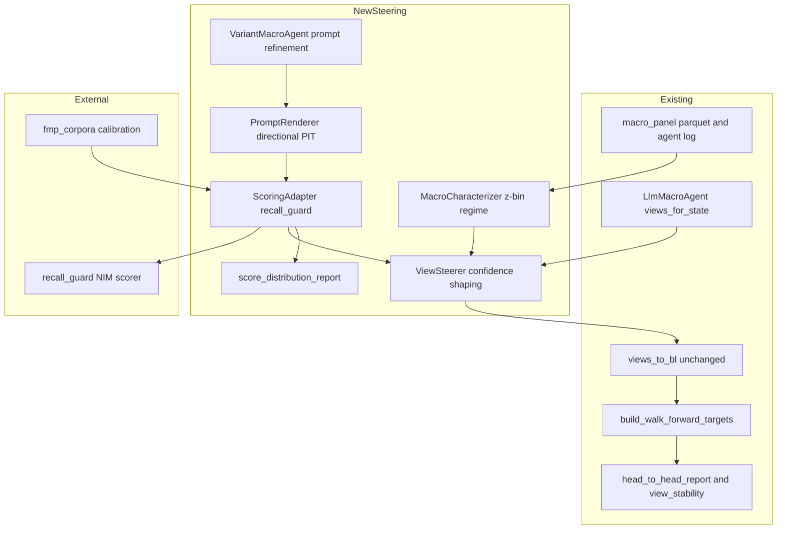
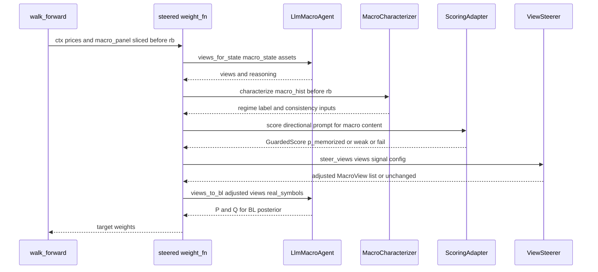
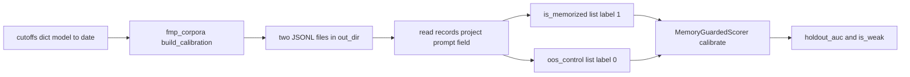

# track-a-macro-steering — Design

## Overview

This feature attaches a **measured memorization signal** (`p_memorized`) and a **point-in-time (PIT)
statistical macro characterization** to Track A's LLM views, and uses both to **shape** the agent's
Black-Litterman view confidence. It adds a new `macro_framework/steering.py` module and two analysis
playbooks (`11_…`, `12_…`) that reuse the existing macro panel, agent log, walk-forward engine, and
head-to-head evaluation **without modifying any of them**.

**Purpose**: give Track A the *quantitative* half of inference-without-recall — contamination is
**observed** (via the released `recall_guard@v0.1.0` library on a separate logprob-bearing NIM path)
rather than assumed, and steering is **grounded** in the macro data's PIT structure rather than free
association. **Users**: the Track A maintainer (a steered portfolio variant) and the researcher (two
playbooks comparing regimes, contamination, and prompt versions). **Impact**: introduces a new,
additive steered variant alongside Baseline / Track A / Track B; existing results stay byte-identical.

The success definition is deliberately **non-predictive**: a steered or refined variant succeeds when
it shows **lower-or-equal measured `p_memorized` with non-degraded head-to-head metrics** — never by
improved forecast accuracy. Near-coin-flip directional skill is the expected, correct baseline.

### Goals
- Score every Track A rebalance decision with a PIT `p_memorized ∈ [0,1]` via a separate inference path.
- Produce a PIT regime + per-series z-score characterization of the macro panel, emitted as a steering signal.
- Add a steered Track A variant whose only effect is confidence/inclusion shaping from macro state + `p_memorized`.
- Compare candidate agent prompts by measured contamination + view stability under PIT.
- Make the steered/refined variant evaluable by the existing head-to-head framework plus the contamination metric.

### Non-Goals
- Any predictive-return / alpha objective, or use of the scorer's directional `signal`/`raw_confidence` as a factor.
- Editing `llm_agent.py`, notebooks `01–10`, `evaluation.py`, the macro/walk-forward modules, or existing `data/` artifacts.
- Modifying the `recall_guard` library or exposing logprobs from the DSPy/OpenRouter agent path.
- New macro data sources beyond the existing FRED panel (FMP is used **only** to build the calibration corpus).

## Boundary Commitments

### This Spec Owns
- A new leaf module `macro_framework/steering.py` and its public contracts (scoring adapter, directional
  PIT prompt renderer, macro characterizer, view steerer, variant agent, score reporter).
- New, additively-named artifacts: the steered variant's targets/equity/decision-log, the per-rebalance
  score log, the macro steering-signal table, and per-prompt-version refinement artifacts.
- Two new playbooks: `notebooks/11_macro_characterization_and_steering.ipynb` and
  `notebooks/12_prompt_refinement_pit.ipynb`.
- The declaration of `recall_guard @ v0.1.0` as a project dependency.

### Out of Boundary
- The agent's decision call (DSPy → OpenRouter Claude) stays exactly as-is.
- Baseline / Track A / Track B targets, logs, equity, and the head-to-head contract — read/extend only.
- Credential provisioning (NIM, FMP, OpenRouter) — consumed from the environment, not owned here.
- The scorer's internal MIA/MCS math and `recall_guard`'s public surface.

### Allowed Dependencies
- **External**: `recall_guard@v0.1.0` (`MemoryGuardedScorer`, `GuardedScore`, `ConfigurationError`,
  `recall_guard.dataset.fmp_corpora`); the NIM endpoint; FMP (calibration corpus only).
- **Internal (read-only import)**: `macro_framework.llm_agent` (`MacroView`, `LlmMacroAgent`),
  `macro_framework.{macro, walk_forward, anonymize, evaluation, returns}`, `data/*` parquets + the
  agent log.
- **Direction**: `steering.py` is a new **leaf consumer** — no existing module may import it.

### Revalidation Triggers
- A change to `recall_guard`'s `MemoryGuardedScorer` / `GuardedScore` contract or `fmp_corpora` API.
- A change to `MacroView`, `views_to_bl`, or the `build_walk_forward_targets` context shape.
- A change to `head_to_head_report` / `view_stability` signatures.
- A change to `LlmMacroAgent._ensure_ready` (the private method `VariantMacroAgent` overrides).
- A change to the NIM scoring model (its training cutoff redefines the IS/OOS split).

## Architecture

### Existing Architecture Analysis
- **PIT discipline is structural**: `build_walk_forward_targets` slices `prices`/`macro_panel` to rows
  strictly `< rebalance_date`; the steered variant reuses this engine, so no-lookahead is inherited.
- **Confidence is already the BL lever**: `views_to_bl` computes `Q = expected_excess · clip(confidence,0,1) / 252`.
  Steering therefore needs only to produce a *new* `MacroView` list with adjusted confidence and call the
  **unchanged** `views_to_bl`.
- **Evaluation is dict-keyed and additive**: `head_to_head_report(pfs, targets)` iterates dict entries;
  adding a `"Track A (steered)"` key requires no edit to `evaluation.py`. `view_stability(views_log)` is reused directly.
- **Constraint respected**: the new module is a leaf; `01–10`, existing modules, and `data/` are untouched (R6).

### Architecture Pattern & Boundary Map

Selected pattern: a **parallel scoring + confidence-shaping sidecar** around the unchanged agent.



**Key decisions** (carried from `research.md`):
- **Two-corpus calibration** is mandatory: the 72-state agent log is **not a labelled directional
  IS/OOS corpus** (its prompts are BL-view requests, not directional micro-tasks, and they carry no
  pre/post-cutoff labels), and `MemoryGuardedScorer.calibrate` requires the **OOS control baseline**
  to reach `min_valid` usable rows (default 50, enforced only on the control baseline — the IS/OOS
  *training* split itself needs only ≥2 valid rows per class). So calibrate the NIM model on a dated
  FMP corpus, then *score* the 72 macro prompts. **Corpus build:**
  `fmp_corpora.build_calibration(out_dir, cutoffs={nim_model: cutoff_date}, …)` **writes two JSONL
  files and returns their paths** (`tuple[Path, Path]`); the adapter reads them back, projects each
  record's `prompt` field to a `Sequence[str]`, and feeds them to `calibrate(is_memorized=,
  oos_control=)`.
- **Directional scoring prompt**: the scorer parses a `direction∈{-1,0,1}` + `confidence∈[0,1]` before
  computing features. The scored prompt reframes the same anonymized, z-scored PIT macro content into
  recall_guard's directional format (same template as the calibration corpus), satisfying R1.2's
  "same content" without reproducing DSPy's BL wire format.
- **Only `p_memorized` steers**; the scorer's `signal`/`raw_confidence` are never used as factors.
- **Linear discount + hard gate**: `adjusted = base · (1 − p_memorized) · consistency`; exclude when
  `p_memorized ≥ threshold`.
- **Graceful degradation**: scoring disabled or `scorer.is_weak` ⇒ `steer_views` returns views
  unchanged ⇒ the steered variant degrades exactly to Track A.

### Technology Stack

| Layer | Choice / Version | Role in Feature | Notes |
|-------|------------------|-----------------|-------|
| Backend / Services | `recall_guard @ v0.1.0` (git) | `p_memorized` scoring + calibrator-quality (`is_weak`) | New dep; lean runtime, pulls no matplotlib/vectorbt |
| Backend / Services | `recall_guard.dataset.fmp_corpora` | IS/OOS calibration corpus builder | Needs FMP key (already provisioned) |
| Backend / Services | NVIDIA NIM endpoint | Separate logprob-bearing inference path | Live; needs `NVIDIA_API_KEY` |
| Data / Storage | pandas / pyarrow parquet + JSON | New steered targets/equity/score/steering-signal artifacts | New filenames only (R6.4) |
| Infrastructure / Runtime | existing `walk_forward` + vectorbt 0.28 | Steered backtest reuses the unchanged engine | No new infra |

New dependency line (PEP 621 `dependencies`):
`recall-guard @ git+https://github.com/norandom/memguard_alpha.git@v0.1.0` (compatible with `>=3.12,<3.13`).

## File Structure Plan

### New Files
```
macro_framework/
└── steering.py                 # NEW leaf module hosting all steering symbols (one file, divided below)
notebooks/
├── 11_macro_characterization_and_steering.ipynb   # R2 + R3 + R5: signals, steered variant, eval delta
└── 12_prompt_refinement_pit.ipynb                 # R4 + R5: prompt-version sweep vs contamination
tests/
└── test_steering.py            # unit tests for steering.py (pure-logic parts; NIM mocked)
```

**Symbol ownership inside `macro_framework/steering.py`** (each row is a task-assignable unit):

| Symbol | Kind | Component | Requirements |
|--------|------|-----------|--------------|
| `render_directional` | function | PromptRenderer | 1.2, 1.4 |
| `CalibrationResult`, `ScoringAdapter` | dataclass + class | ScoringAdapter | 1.2, 1.3, 1.5, 1.7 |
| `_read_corpus_jsonl` | helper | ScoringAdapter (FMP JSONL → `Sequence[str]`) | 1.2 |
| `SteeringSignal`, `characterize` | dataclass + function | MacroCharacterizer | 2.1–2.5 |
| `SteeringConfig`, `steer_views` | dataclass + function | ViewSteerer | 1.6, 3.1–3.5 |
| `VariantMacroAgent` | class (subclasses `LlmMacroAgent`) | VariantMacroAgent | 4.1, 4.4 |
| `score_distribution_report` | function | score_distribution_report | 4.2, 5.2 |

New `data/` artifacts (written by the playbooks; additive names only — R6.4):
- `data/track_a_steered_targets_2019_2024.parquet`, `data/track_a_steered_equity_2019_2024.parquet`
- `data/track_a_steered_agent_log.json` (steered views + adjusted confidence + per-rebalance `p_memorized`)
- `data/track_a_scores_<nim_model>.json` (per-rebalance `GuardedScore` fields + calibrator AUC/weak flag)
- `data/macro_steering_signals_2019_2024.parquet` (regime label + per-series PIT z-summary + consistency inputs)
- `data/prompt_refinement_<version>_scores.json` (per prompt version: `p_memorized` distribution + view-stability)
- per-variant agent caches: `.llm_cache_<version>/` (distinct dirs prevent cache collision)

> Filename sanitization: `<nim_model>` ids contain `/` (e.g. `meta/llama-3.1-8b-instruct`); slugify
> (`/` → `_`) before embedding in `track_a_scores_<nim_model>.json`. `<version>` is a safe token (e.g. `v2`).

### Modified Files
- `pyproject.toml` — add the `recall-guard` git dependency to `[project].dependencies` (the **only**
  edit to an existing file; no behavioral source is modified).

## System Flows

### Steered rebalance (per date, within walk-forward)



The steered weight_fn **holds the same `LlmMacroAgent` (or `VariantMacroAgent`) instance** it used for
`views_for_state` and calls that instance's **unchanged** `views_to_bl(adjusted_views, real_symbols)`;
`real_symbols = list(ctx["prices"].columns)` (the real tickers), exactly as the Track A weight_fn in
nb09 sources them. Gating: if `p_memorized` is unavailable (`fail_reason`), or the calibrator
`is_weak`, or scoring is disabled, `steer_views` returns the original views — the steered variant
equals Track A for that date. A per-rebalance `p_memorized ≥ threshold` excludes that rebalance's views
(defensive fallback to base).

### Calibration (one-time, before scoring)



`build_calibration` writes JSONL (records shaped `prompt`, `label`, `metadata`) and returns the two
file paths; the adapter reads them back, projects `prompt` to `Sequence[str]`, and passes the IS
(label 1) list as `is_memorized` and the OOS (label 0) list as `oos_control` to `calibrate`.

## Requirements Traceability

| Requirement | Summary | Components | Interfaces | Flows |
|-------------|---------|------------|------------|-------|
| 1.1 | Pin `recall_guard@v0.1.0` | `pyproject.toml` | dependency line | — |
| 1.2 | PIT `p_memorized` per decision from same content | `PromptRenderer`, `ScoringAdapter` | `render_directional`, `score_rebalances` | Steered rebalance |
| 1.3 | Separate inference path | `ScoringAdapter` (NIM) | `score_rebalances` | Steered rebalance |
| 1.4 | Score only as-of info | `PromptRenderer` (PIT content), walk-forward slicing | `render_directional` | Steered rebalance |
| 1.5 | Clear config error on bad credential | `ScoringAdapter` | propagates `ConfigurationError` | Calibration / scoring |
| 1.6 | Scoring additive (disabled ⇒ unaffected) | `ViewSteerer` | `steer_views` (passthrough) | Steered rebalance gating |
| 1.7 | Surface weak calibrator | `ScoringAdapter` | `is_weak` / `holdout_auc` | Calibration |
| 2.1 | PIT regime + per-series z-summary | `MacroCharacterizer` | `characterize` | Calibration n/a; nb11 |
| 2.2 | Exclude post-date observations | `MacroCharacterizer` (consumes `< rb`) | `characterize` | Steered rebalance |
| 2.3 | Reuse macro artifacts | `MacroCharacterizer` | reads panel parquet | nb11 |
| 2.4 | Emit consumable steering signals | `MacroCharacterizer` | `SteeringSignal` + signals artifact | nb11 → steerer |
| 2.5 | No forecasting target | `MacroCharacterizer` | (deterministic labels only) | — |
| 3.1 | Confidence falls as `p_memorized` rises | `ViewSteerer` | `steer_views` | Steered rebalance |
| 3.2 | Exclude views over threshold | `ViewSteerer` | `steer_views` (gate) | Steered rebalance |
| 3.3 | Own targets + decision log | nb11 + new artifacts | walk-forward weight_fn | Steered rebalance |
| 3.4 | Only confidence/inclusion shaping | `ViewSteerer` | `steer_views` | Steered rebalance |
| 3.5 | No predictive-return objective | `ViewSteerer`, boundary | (no return target) | — |
| 4.1 | Evaluate multiple prompt versions over same PIT stream | `VariantMacroAgent` | subclass + per-variant cache | nb12 |
| 4.2 | Report `p_memorized` dist + view stability per version | `score_distribution_report`, `view_stability` | report fns | nb12 |
| 4.3 | Report head-to-head deltas | `head_to_head_report` (reused) | additive dict key | nb12 |
| 4.4 | Preserve prior prompt versions | `VariantMacroAgent` | versioned instructions + cache dirs | nb12 |
| 4.5 | Adopt refined prompt only if not worse | nb12 accept-gate | `head_to_head_report` compare | nb12 |
| 5.1 | Evaluable by existing head-to-head | nb11/nb12 + `head_to_head_report` | additive dict key | Eval |
| 5.2 | Additionally report `p_memorized` distribution | `score_distribution_report` | report fn | Eval |
| 5.3 | Non-predictive success definition | nb accept-gate, boundary | compare metrics + contamination | Eval |
| 6.1 | No edits to `01–10`/modules/`data/` | new module + nb11/nb12 | (leaf module) | — |
| 6.2 | `11_`/`12_` numbering | new notebooks | — | — |
| 6.3 | Append-only research log | `research.md` | — | — |
| 6.4 | New filenames for new artifacts | nb11/nb12 outputs | additive names | — |

## Components and Interfaces

| Component | Domain/Layer | Intent | Req Coverage | Key Dependencies (P0/P1) | Contracts |
|-----------|--------------|--------|--------------|--------------------------|-----------|
| `PromptRenderer` | steering | Render same PIT macro content as a directional scoring prompt | 1.2, 1.4 | none (pure) | Service |
| `ScoringAdapter` | steering | Calibrate + score via recall_guard; surface weakness/errors | 1.2, 1.3, 1.5, 1.7 | recall_guard (P0), NIM (P0), fmp_corpora (P1) | Service |
| `MacroCharacterizer` | steering | PIT regime + z-summary + consistency inputs | 2.1–2.5 | macro panel (P0) | Service, Batch |
| `ViewSteerer` | steering | Shape view confidence/inclusion from signal | 1.6, 3.1–3.5 | MacroView (P0) | Service |
| `VariantMacroAgent` | steering | Prompt-version variants without editing base agent | 4.1, 4.4 | `LlmMacroAgent` (P0) | Service, State |
| `score_distribution_report` | steering | Summarize `p_memorized` distribution for eval | 4.2, 5.2 | GuardedScore (P1) | Service |

### Steering domain

#### PromptRenderer

| Field | Detail |
|-------|--------|
| Intent | Convert `(macro_state, asset_snapshot)` into a directional-forecast prompt carrying the same PIT content |
| Requirements | 1.2, 1.4 |

**Responsibilities & Constraints**
- Pure, deterministic; embeds the **same anonymized, z-scored** values the agent saw (no dates, no tickers).
- Output must elicit a parseable `direction∈{-1,0,1}` + `confidence∈[0,1]` and must use the **same
  template** as the calibration corpus so MIA features are comparable.
- Owns no state; takes only as-of inputs (PIT inherited from the caller's slicing).

**Dependencies**
- Inbound: `ViewSteerer` / weight_fn — supplies macro content (P0)
- Outbound: `ScoringAdapter` — consumes the rendered prompt (P0)

**Contracts**: Service [x]

##### Service Interface
```python
def render_directional(
    macro_state: dict[str, float],          # {cpi_yoy_z, t10y2y_z, hy_oas_z}, rounded as the agent rounds
    asset_snapshot: list[dict[str, object]],# anonymized [{id, category, trailing_12m_return, trailing_vol_ann}]
) -> str: ...
```
- Preconditions: inputs contain no calendar date or real ticker.
- Postconditions: returned text matches the calibration-corpus prompt template; deterministic for equal inputs.
- Invariants: identical macro content ⇒ identical prompt string.

**Implementation Notes**
- Integration: template is shared with the calibration corpus generation step (single source of truth).
- Validation: a smoke check confirms the chosen NIM model returns a parseable direction+confidence before the 72-state run.
- Risks: a model that ignores the format ⇒ `FAIL_PARSE`; mitigated by the smoke check + template tuning.

#### ScoringAdapter

| Field | Detail |
|-------|--------|
| Intent | Own calibration + per-rebalance scoring via `recall_guard`; expose quality + errors |
| Requirements | 1.2, 1.3, 1.5, 1.7 |

**Responsibilities & Constraints**
- Wraps `MemoryGuardedScorer`; performs two-corpus calibration then scoring on the separate NIM path.
- Surfaces `ConfigurationError` unchanged (R1.5); exposes `holdout_auc` / `is_weak` (R1.7).
- Returns only `p_memorized` (+ `fail_reason`, optional `memguard_confidence`) to the steerer; never the directional `signal`.

**Dependencies**
- External: `recall_guard.MemoryGuardedScorer` (P0), NIM endpoint (P0), `fmp_corpora` (P1)

**Contracts**: Service [x]

##### Service Interface
```python
@dataclass(frozen=True)
class CalibrationResult:
    scorer: "MemoryGuardedScorer"
    holdout_auc: float
    is_weak: bool

def _read_corpus_jsonl(path: "Path") -> list[str]: ...
# read a build_calibration JSONL file, return each record's "prompt" field, order preserved.

class ScoringAdapter:
    @classmethod
    def calibrate_from_fmp(
        cls, *, nim_model: str, cutoff_date: "date", out_dir: "Path",
        api_key: str, fmp_api_key: str | None = None,
        reference_model: str | None = None,
        min_auc: float = 0.6, target_per_corpus: int = 100,
    ) -> "ScoringAdapter": ...
    # 1) is_path, oos_path = fmp_corpora.build_calibration(
    #        out_dir, cutoffs={nim_model: cutoff_date},
    #        target_per_corpus=target_per_corpus, api_key=fmp_api_key)   # writes 2 JSONL, returns paths
    # 2) is_memorized = _read_corpus_jsonl(is_path); oos_control = _read_corpus_jsonl(oos_path)
    # 3) MemoryGuardedScorer.calibrate(api_key=api_key, model=nim_model,
    #        is_memorized=is_memorized, oos_control=oos_control,
    #        reference_model=reference_model, min_auc=min_auc)
    # Raises ConfigurationError on empty/rejected NIM key (propagated from calibrate).

    @property
    def is_weak(self) -> bool: ...        # delegates to scorer.is_weak (R1.7)
    @property
    def holdout_auc(self) -> float: ...   # delegates to scorer.holdout_auc

    def score_rebalances(self, prompts: Sequence[str]) -> list["GuardedScore"]: ...
    # thin wrapper over scorer.score_many; order-preserving; one NIM call per prompt.
```
- Preconditions: `api_key` non-empty; `cutoff_date` is the chosen `nim_model`'s training cutoff; `out_dir` writable; FMP key available (env or arg).
- Postconditions: `is_weak`/`holdout_auc` reflect the trained calibrator; `score_rebalances` returns one `GuardedScore` per prompt in input order.
- Invariants: scoring uses only the rendered as-of prompt content.

**Implementation Notes**
- Integration: `calibrate_from_fmp` is one-time; the JSONL corpora + the calibration result (AUC, weak flag) are persisted (the score-log header records `nim_model`, `cutoff_date`, `holdout_auc`, `is_weak`).
- Validation: `calibrate` itself enforces the corpus floors — the **OOS control baseline** needs ≥`min_valid` (default 50) usable rows (raises `ValueError` otherwise); the IS/OOS training split needs ≥2 valid rows per class. The adapter surfaces these failures without swallowing them.
- Risks: weak AUC on homogeneous corpora — handled by `is_weak` → unsteered fallback (R1.7).

#### MacroCharacterizer

| Field | Detail |
|-------|--------|
| Intent | PIT regime label + per-series z-summary + per-view consistency inputs |
| Requirements | 2.1–2.5 |

**Responsibilities & Constraints**
- Consumes only macro rows `< rebalance_date` (R2.2); reuses the existing panel (R2.3); regenerates nothing.
- **Deterministic z-bin regime** (e.g. sign/magnitude bins of `cpi_yoy_z`, `t10y2y_z`, `hy_oas_z`); no fitted/forecasting target (R2.5).
- Emits a per-rebalance `SteeringSignal` and a serializable signals table (R2.4).

**Contracts**: Service [x] / Batch [x]

##### Service Interface
```python
@dataclass(frozen=True)
class SteeringSignal:
    rebalance_date: "pd.Timestamp"
    regime_label: str                       # e.g. "stagflation_risk", "goldilocks", "credit_stress", "neutral"
    zscore_summary: dict[str, float]        # latest as-of z per series
    def consistency(self, view: "MacroView") -> float: ...
    # in [consistency_floor, 1.0]: 1.0 if the view aligns with the regime's preferred
    # asset categories, falling to the floor when it contradicts (documented heuristic).

def characterize(macro_hist: "pd.DataFrame", rebalance_date: "pd.Timestamp") -> SteeringSignal: ...
```
- Preconditions: `macro_hist` already sliced `< rebalance_date`.
- Postconditions: deterministic label + summary; `consistency` is a pure function of (regime, view categories).
- Invariants: no observation dated `≥ rebalance_date` influences the result.

**Implementation Notes**
- Integration: regime→preferred-category map is an explicit, documented table (not learned).
- Risks: coarse/sparse macro states (~72) — acceptable; the regime is a steering prior, not a predictor.

#### ViewSteerer

| Field | Detail |
|-------|--------|
| Intent | Produce a new `MacroView` list with shaped confidence / inclusion |
| Requirements | 1.6, 3.1–3.5 |

**Responsibilities & Constraints**
- `adjusted_confidence = base_confidence · (1 − p_memorized) · signal.consistency(view)` (R3.1, 3.4).
- Drop the rebalance's views when `p_memorized ≥ config.threshold` (R3.2).
- If `p_memorized is None` (fail), `scorer.is_weak`, or `not config.enabled` ⇒ return views **unchanged** (R1.6, 1.7, 3.4).
- Never changes `expected_excess_annualized`, asset legs, or introduces a return objective (R3.4, 3.5).

**Contracts**: Service [x]

##### Service Interface
```python
@dataclass(frozen=True)
class SteeringConfig:
    enabled: bool = True
    threshold: float = 0.8          # p_memorized at/above which views are excluded
    consistency_floor: float = 0.5  # min macro-consistency multiplier

def steer_views(
    views: list["MacroView"],
    p_memorized: float | None,
    signal: "SteeringSignal",
    config: SteeringConfig = SteeringConfig(),
) -> list["MacroView"]: ...
```
- Preconditions: `views` from the same rebalance as `signal`/`p_memorized`.
- Postconditions: returns a **new** list (input untouched); confidence clipped to `[0,1]`; passthrough on disabled/weak/fail.
- Invariants: output is consumed by the **unchanged** `views_to_bl`.

**Implementation Notes**
- Integration: the steered weight_fn calls `agent.views_for_state` → `characterize` → `score_rebalances` → `steer_views` → `views_to_bl`, mirroring the Track A weight_fn (nb09) shape.
- Risks: over-aggressive gating empties views ⇒ BL posterior falls back to the base (HRP-CVaR) — acceptable, documented.

#### VariantMacroAgent

| Field | Detail |
|-------|--------|
| Intent | Run alternative prompt versions without editing `llm_agent.py` |
| Requirements | 4.1, 4.4 |

**Responsibilities & Constraints**
- Subclass of `LlmMacroAgent`; supplies custom `instructions` + `prompt_version`; uses a **per-variant `cache_dir`** to avoid diskcache key collision (the base `_cache_key` keys on the **module-level** `PROMPT_VERSION="v1"` constant, not an instance attribute, so distinct variants sharing one cache would return each other's cached responses).
- **Override mechanics (explicit):** the base bakes `AGENT_INSTRUCTIONS` into `MacroViewSignature.__doc__` **inside the private `_ensure_ready()`**; `__init__` exposes no `instructions` hook. The subclass therefore **overrides `_ensure_ready()`**, re-creating the DSPy LM/predict/diskcache setup with the variant's `instructions`. This duplicates ~15 lines of the base's private setup — accepted as the additive cost of not editing `llm_agent.py` (R6.1); it depends on a private internal of a read-only module and is a **Revalidation Trigger** if the base's `_ensure_ready` changes.
- Additive: the base module and its `.llm_cache/` (`"v1"`) are untouched; prior versions preserved (R4.4).

**Contracts**: Service [x] / State [x]

##### Service Interface
```python
class VariantMacroAgent(LlmMacroAgent):
    def __init__(self, *, instructions: str, prompt_version: str,
                 cache_dir: str | Path, **kwargs) -> None: ...
    def _ensure_ready(self) -> None: ...   # override: rebuild signature with self.instructions
```
- Preconditions: distinct `prompt_version` ⇒ distinct `cache_dir`.
- Postconditions: `views_for_state` behaves as the base but with the variant's prompt + isolated cache.
- Invariants: no write to the base `.llm_cache/` or to `llm_agent.py`.

**Implementation Notes**
- State: each version owns `.llm_cache_<version>/`; cached responses are reproducible.
- Risks: (a) base `_ensure_ready` changes break the override — covered by a Revalidation Trigger; (b) prompt overfitting to the eval window — mitigated by the nb12 accept-gate (R4.5) and out-of-window comparison.

#### score_distribution_report

| Field | Detail |
|-------|--------|
| Intent | Summarize the `p_memorized` distribution (and fail rates) for evaluation |
| Requirements | 4.2, 5.2 |

**Contracts**: Service [x]

##### Service Interface
```python
def score_distribution_report(scores: Sequence["GuardedScore"]) -> dict[str, float]: ...
# returns e.g. {p_mem_mean, p_mem_median, p_mem_p90, parse_fail_rate, n_scored, holdout_auc}
```
- Postconditions: pure summary over the score log; no NIM calls.

## Data Models

### Domain Model
- **GuardedScore** (from `recall_guard`, read-only): `prompt_hash, parse_ok, signal, raw_confidence,
  p_memorized, memguard_confidence, features, fail_reason`. Only `p_memorized` and `fail_reason` are
  **steering inputs**. `memguard_confidence` (= `raw_confidence·(1−p_memorized)`) may be **reported**
  for diagnostics but is **never** a steering input — using it would leak the scorer's `raw_confidence`
  into the decision and break the non-predictive guarantee (Non-Goals). The scorer's `signal` /
  `raw_confidence` are never read.
- **SteeringSignal** (owned): per-rebalance `regime_label`, `zscore_summary`, and a `consistency(view)` map.
- **SteeringConfig** (owned): `enabled`, `threshold`, `consistency_floor`.

### Logical Data Model (new artifacts)
- `macro_steering_signals_2019_2024.parquet`: index = rebalance_date; columns = `regime_label`,
  `cpi_yoy_z`, `t10y2y_z`, `hy_oas_z` (as-of), and the preferred-category encoding.
- `track_a_scores_<nim_model>.json`: per rebalance_date → `{p_memorized, parse_ok, fail_reason,
  memguard_confidence}` + header `{nim_model, cutoff_date, holdout_auc, is_weak}`.
- `track_a_steered_agent_log.json`: per rebalance_date → `{views, base_confidence, adjusted_confidence,
  p_memorized, regime_label}` (mirrors the precious `track_a_agent_log.json` shape; new filename).
- `track_a_steered_{targets,equity}_2019_2024.parquet`: same schema as the existing Track A artifacts.

### Data Contracts & Integration
- Steered targets/equity feed the existing vectorbt simulation and `head_to_head_report` via a new
  `"Track A (steered)"` dict key — no schema change to evaluation.

## Error Handling

### Error Strategy
- **Configuration (fail fast)**: missing/rejected NIM or FMP credential ⇒ `ConfigurationError`
  propagated from `ScoringAdapter` at calibrate/score time (R1.5); the playbook stops with an actionable message.
- **Weak calibrator (graceful)**: `scorer.is_weak` ⇒ record the weakness, run the variant **unsteered**,
  and report it as a valid contamination finding (R1.7) — do not steer on an unvalidated score.
- **Per-rebalance scoring failure (graceful)**: `GuardedScore.fail_reason` set (timeout/parse/error) ⇒
  that rebalance is passed through unsteered; the fail is logged for the distribution report.
- **Empty views after gating (graceful)**: `views_to_bl` returns `(None, None)` ⇒ BL posterior falls
  back to the base allocation (existing behavior), preserving a valid portfolio.

### Monitoring
- The score log persists `holdout_auc`, `is_weak`, and per-rebalance `fail_reason`; `score_distribution_report`
  surfaces `parse_fail_rate` and the `p_memorized` distribution per variant.

## Testing Strategy

### Unit Tests (`tests/test_steering.py`; NIM/FMP mocked)
- `steer_views`: confidence falls monotonically as `p_memorized` rises; exclusion at `threshold`; passthrough when disabled / weak / `p_memorized is None` (3.1, 3.2, 1.6, 1.7).
- `render_directional`: deterministic; contains no date/ticker; equal content ⇒ equal string (1.2, 1.4).
- `characterize`: ignores rows `≥ rebalance_date`; deterministic regime label; `consistency` within `[floor, 1.0]` (2.1, 2.2, 2.4).
- `VariantMacroAgent`: distinct versions use distinct cache dirs (no collision) and never write base cache (4.1, 4.4).
- `score_distribution_report`: correct aggregates incl. `parse_fail_rate` over mixed pass/fail scores (4.2, 5.2).

### Integration Tests
- Steered weight_fn end-to-end on a tiny fixture (mocked agent + mocked scorer) through `views_to_bl` → walk-forward, asserting a valid target row and the unsteered-fallback path (3.3, 1.6).
- `ScoringAdapter.calibrate_from_fmp` surfaces `ConfigurationError` on empty key and `is_weak` on a degenerate corpus (1.5, 1.7).
- Adding `"Track A (steered)"` to `head_to_head_report` produces a comparable row without modifying `evaluation.py` (5.1).

### E2E (notebook smoke, gated by live credentials)
- nb11: build signals → score 72 rebalances → steered backtest → head-to-head delta + `p_memorized` distribution (R2, R3, R5).
- nb12: ≥2 prompt versions over the same PIT stream → per-version contamination + view-stability + head-to-head delta; accept only if not worse (R4, 5.3).

## Open Questions / Risks
- **Calibration AUC** depends on the FMP corpus + chosen NIM model cutoff; if `is_weak`, the honest result is "run unsteered, report the weakness." (Carried to tasks as a verification step.)
- **Directional template** must elicit a parseable direction+confidence from the chosen NIM model — verify on a small sample before the 72-state run.
- **Regime→category consistency** map is a deliberate, documented heuristic; it must remain non-predictive (no return fitting).
- **NIM model + cutoff** selection (e.g. `meta/llama-3.1-8b-instruct`) is a design input fixed at task time; it defines the IS/OOS split key.
- **Gate inertness is acceptable.** The research predicts intentionally-anonymized macro prompts yield uniformly low `p_memorized`, so the `threshold` exclusion (default 0.8) may rarely or never fire. That is the **expected, desired** outcome (low contamination); the `(1−p_memorized)` discount still applies continuously. Treat a never-firing gate as a finding, not a bug.
