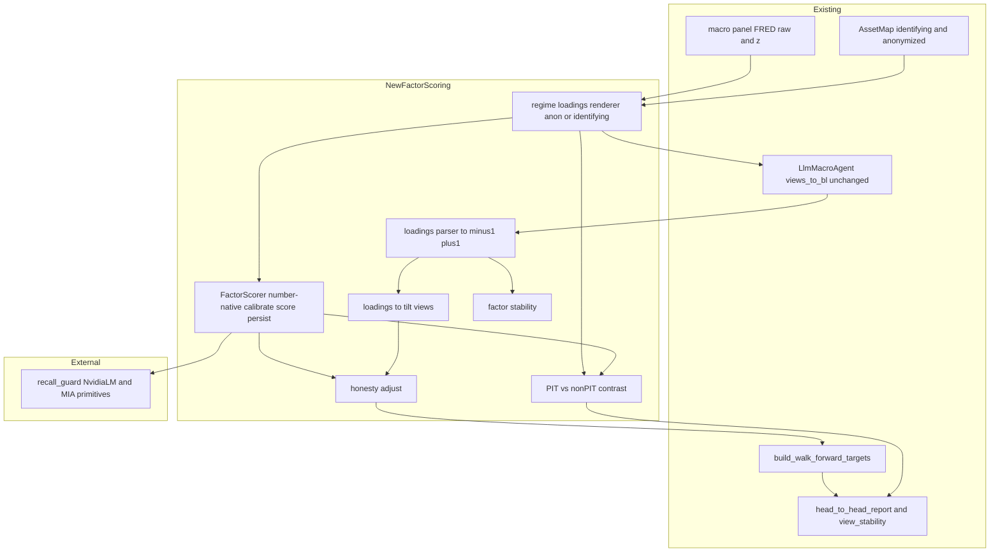
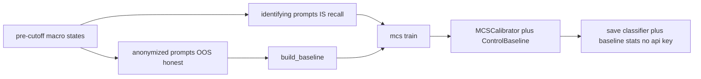
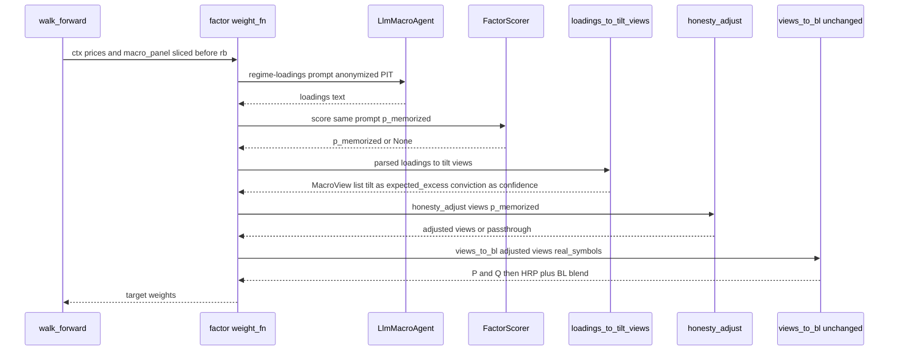

# version-aware-factor-scoring — Design

## Overview

This feature makes **AI macro factors** — continuous, relative exposures inferred from the macro
**numbers** — the unit of work, and measures their contamination **number-natively** so prompt versions
(and the PIT vs non-PIT discipline) are distinguishable by measured memorization. It adds a new
`macro_framework/factor_scoring.py` module and two playbooks (`13_…`, `14_…`), building additively on
the `track-a-macro-steering` engine and the released `recall_guard@v0.1.0` public MIA primitives.

**Purpose**: give Track A a *factor* representation (regime-as-loadings + BL-tilt-as-exposure) whose
honesty is measured by whether revealing the period in the numbers triggers **recall** versus
**inference**. The calibrator is trained on the macro numbers themselves (identifying = recall-enabled
vs anonymized = honest), validated at `holdout_auc ≈ 0.96` — no news, no domain mismatch. Every factor
is delivered as an **honesty-adjusted exposure** (`raw × (1 − p_memorized)`), and a **PIT vs non-PIT
contrast** quantifies the contamination premium.

**Users**: the Track A maintainer (a factor-driven, honesty-adjusted portfolio variant) and the
researcher (prompt refinement by measured contamination + the PIT/non-PIT diagnostic). Success is
**non-predictive**: factors are characterizations; success = factor stability + lower-or-equal
contamination + non-degraded head-to-head, never forecast accuracy.

### Goals
- Score each factor prompt version number-natively for `p_memorized` (differentiates versions; no directional parse).
- Emit a regime-as-loadings factor and a BL-tilt-as-exposure reframe of the agent's views.
- Deliver honesty-adjusted exposures (down-weighted by measured contamination).
- Compare prompt versions by version-aware contamination + factor stability + head-to-head.
- Quantify the PIT vs non-PIT contamination premium.

### Non-Goals
- Any predictive-return / alpha objective; using a directional signal as a return factor.
- Editing `recall_guard`, `llm_agent.py`, `steering.py`, `evaluation.py`, notebooks `01–12`, or existing `data/`.
- News-based calibration; new data sources beyond the FRED panel.
- The deferred factor archetypes (β matrix, thematic-intensity, cross-sectional ranking, dispersion/tail).

## Boundary Commitments

### This Spec Owns
- A new leaf module `macro_framework/factor_scoring.py` and its contracts: the number-native
  `FactorScorer`, the regime-loadings renderer + `[-1,1]` parser, the tilt-as-exposure builder, the
  honesty-adjustment, the PIT-vs-non-PIT contrast harness, and a factor-stability metric.
- New playbooks `notebooks/13_…` and `notebooks/14_…`.
- New, additively-named artifacts: the persisted number-native calibrator, the factor/score logs, the
  factor-steered targets/equity/decision-log, and the contrast report.

### Out of Boundary
- The agent's decision call and `views_to_bl` (reused unchanged); Baseline / Track A / Track B / the
  head-to-head contract (read/extend only).
- `recall_guard`'s internals and its directional `MemoryGuardedScorer` façade (we use the lower-level
  public primitives only).
- The `track-a-macro-steering` `steering.py` symbols (referenced as a pattern; never edited).
- Credential provisioning and the Postgres price DB (notebooks substitute yfinance).

### Allowed Dependencies
- **External**: `recall_guard@v0.1.0` public primitives — `NvidiaLM`, `compute_mia_features`,
  `MiaFeatures`, `ControlBaseline`, `build_baseline`, `standardise`, `MCSCalibrator`, `LOGPROB_FLOOR`,
  and `train` (imported `from recall_guard.mia.mcs import train`; top-level alias `train_mcs`); the NIM
  endpoint. Note: `recall_guard`'s `ConfigurationError` is NOT on this primitive path (it lives only in
  the bypassed `MemoryGuardedScorer` façade) — this spec defines and raises its own.
- **Internal (read-only import)**: `macro_framework.llm_agent` (`MacroView`, `LlmMacroAgent.views_to_bl`,
  `LlmMacroAgent`), `macro_framework.anonymize` (`AssetMap`), `macro_framework.{macro, walk_forward,
  evaluation, returns}`, and `macro_framework as mf` (`hrp_cvar_weights_with_fixed`, `bl_mv_weights`,
  `build_walk_forward_targets`), plus the macro panel parquet.
- **Direction**: `factor_scoring.py` is a new **leaf consumer** — no existing module imports it.

### Revalidation Triggers
- A change to the `recall_guard` MIA primitives (`compute_mia_features`, `MCSCalibrator.predict_proba`,
  `build_baseline`, `train`) or `NvidiaLM`.
- A change to `MacroView` / `views_to_bl`, the `build_walk_forward_targets` context, or
  `head_to_head_report` / `view_stability`.
- A change to the NIM scoring model (its cutoff defines the pre-cutoff IS window).
- A change to `AssetMap` (the identifying ↔ anonymized mapping the calibration depends on).

## Architecture

### Existing Architecture Analysis
- **The MIA primitives bypass the directional parse.** `compute_mia_features(response, logprobs,
  ref_logprobs)` is pure and computes the five features from the model's response + per-token logprobs;
  the `direction+confidence` gate lives only in the `MemoryGuardedScorer` façade. Scoring a factor
  prompt's response is therefore number-native and version-aware (validated: distinct prompts → distinct
  `p_memorized`).
- **Calibration is number-native.** `build_baseline(lm, oos_rows, …)` + `mcs.train(lm, is_rows,
  oos_rows, baseline, …)` train on **macro-number prompts on the factor task**: IS = identifying
  (recall-enabled), OOS = anonymized (honest). `predict_proba(features, baseline)` needs **both** the
  calibrator and the `ControlBaseline`. Validated `holdout_auc ≈ 0.96`.
- **`views_to_bl` already computes `tilt × conviction`.** `Q = expected_excess_annualized ·
  clip(confidence,0,1) / 252` → reinterpret `expected_excess_annualized := tilt`, `confidence :=
  conviction`; the unchanged method yields `Q = tilt·conviction/252` (R3).
- **The honesty discount mirrors only the `steer_views` *discount* limb** (`raw·(1−p_mem)`) —
  re-implemented in the new module (R6 forbids editing `steering.py`). It does NOT copy `steer_views`'
  hard exclusion gate: R4 is magnitude-only.
- **The pipeline + eval are reused unchanged**: nb09's `hrp_cvar_weights_with_fixed` + `bl_mv_weights`
  (Utility) + 0.7/0.3 blend via `build_walk_forward_targets`; `head_to_head_report(pfs, targets)` (add a
  `"Track A (factor)"` entry to the input dicts — no edit); `view_stability(views_log)`, which consumes
  **dict** views, so the factor stream is logged via `MacroView.to_dict()` before `view_stability` /
  `factor_stability`.

### Architecture Pattern & Boundary Map

Pattern: a **number-native factor + honesty layer** sidecar around the unchanged agent/pipeline.



**Key decisions** (from research.md): number-native calibration (identifying IS vs anonymized OOS on the
factor task — no news/FMP); MIA-primitive scoring (no façade); tilt-as-exposure by field reinterpretation
into the unchanged `views_to_bl`; honesty-adjusted exposure `raw·(1−p_mem)`; persist the calibrator +
baseline (not the API key) to avoid the ~135-call rebuild; the identifying-vs-anonymized axis is shared
by both the calibration labels and the R7 contrast.

### Technology Stack

| Layer | Choice / Version | Role in Feature | Notes |
|-------|------------------|-----------------|-------|
| Backend / Services | `recall_guard@v0.1.0` public MIA primitives | number-native `p_memorized` scoring + calibration | No façade; no news |
| Backend / Services | NVIDIA NIM (`meta/llama-4-maverick-17b-128e-instruct`) | logprob-bearing scoring path; cutoff 2024-08-01 | Validated AUC≈0.96 |
| Backend / Services | OpenRouter (existing agent) | factor reasoning generation (nb14 variants) | Unchanged path |
| Data / Storage | FRED macro panel parquet; sklearn+JSON for the persisted calibrator | calibration corpus + persisted scorer | No FMP/news |
| Infrastructure / Runtime | existing `build_walk_forward_targets` + vectorbt | factor-steered backtest | yfinance prices in-notebook |

## File Structure Plan

### New Files
```
macro_framework/
└── factor_scoring.py        # NEW leaf module hosting all factor-scoring symbols (one file, divided below)
notebooks/
├── 13_macro_factor_scoring.ipynb       # R2/R3/R4/R5(part)/R6: regime-loadings + honesty-adjusted variant + head-to-head
└── 14_factor_prompt_refinement_pit.ipynb   # R5/R7: version-aware prompt refinement + PIT-vs-non-PIT contrast
tests/
└── test_factor_scoring.py   # unit tests for the module (NIM mocked)
```

**Symbol ownership inside `macro_framework/factor_scoring.py`** (each row is a task-assignable unit):

| Symbol | Kind | Component | Requirements |
|--------|------|-----------|--------------|
| `MACRO_AXES`, `render_regime_loadings_prompt` | constant + function | RegimeLoadingsPrompt | 2.1, 2.2, 2.3, 7.1 |
| `RegimeLoadings`, `parse_loadings` | dataclass + function | LoadingsParser | 2.1, 2.4 |
| `ConfigurationError`, `FactorScore`, `CalibrationStats`, `FactorScorer` | error + dataclasses + class | FactorScorer | 1.1–1.6, 6.5 |
| `_build_corpus` | helper | FactorScorer (identifying IS + anonymized OOS) | 1.x calibration |
| `REGIME_ASSET_EXPOSURE`, `loadings_to_tilt_views` | table + function | TiltExposure | 3.1, 3.2, 3.4 |
| `HonestyConfig`, `honesty_adjust` | dataclass + function | HonestyAdjust | 4.1–4.4 |
| `factor_stability` | function | FactorStability | 5.2 |
| `ContrastResult`, `run_pit_vs_nonpit_contrast` | dataclass + function | ContrastHarness | 7.1–7.6 |

### Modified Files
- *(none in source)* — the only repo-manifest touch was the `recall_guard` dependency, already present
  from `track-a-macro-steering`. New artifacts are written under new filenames; price-dependent ones are gitignored.

## System Flows

### Number-native calibration (one-time, persisted)

Both corpora use the **same regime-loadings task**; the only difference is identifying vs anonymized
framing (R7 axis). `holdout_auc`/`is_weak` are recorded; if `is_weak`, scoring still runs but the
honesty adjustment falls back to unadjusted (R4.3 / R1.6).

### Factor rebalance (per date, within walk-forward)

Gating: loadings that fail to parse, or `p_memorized` unavailable / `is_weak`, fall back to the base
allocation / unadjusted exposures (the steered variant degrades to the base, as Track A does).

## Requirements Traceability

| Requirement | Summary | Components | Interfaces | Flows |
|-------------|---------|------------|------------|-------|
| 1.1 | `p_memorized` from version's own prompt+reasoning | FactorScorer | `score` | Factor rebalance |
| 1.2 | Differentiates prompt versions | FactorScorer | `score` (validated) | nb14 |
| 1.3 | No directional parse required | FactorScorer | `score` (MIA primitives) | Calibration/score |
| 1.4 | PIT scoring (as-of only) | RegimeLoadingsPrompt (anon/z) | `render_regime_loadings_prompt` | Factor rebalance |
| 1.5 | Config error on bad credential | FactorScorer | raises own `factor_scoring.ConfigurationError` | Calibration/score |
| 1.6 | Surface weak calibrator | FactorScorer | `is_weak`/`holdout_auc` | Calibration |
| 2.1 | Regime loadings vector in [-1,1] | RegimeLoadingsPrompt, LoadingsParser | `render_…`, `parse_loadings` | Factor rebalance |
| 2.2 | No direction/return in output | RegimeLoadingsPrompt | prompt contract | — |
| 2.3 | Loadings use only as-of macro obs | RegimeLoadingsPrompt | as-of inputs | Factor rebalance |
| 2.4 | Emit loadings as keyed artifact | LoadingsParser, nb13 | `RegimeLoadings` + artifact | nb13 |
| 2.5 | No forecasting target | RegimeLoadingsPrompt | (loadings only) | — |
| 3.1 | View = dimensionless tilt | TiltExposure | `loadings_to_tilt_views` | Factor rebalance |
| 3.2 | Q = tilt × conviction | TiltExposure + unchanged `views_to_bl` | field reinterpretation | Factor rebalance |
| 3.3 | Reuse `views_to_bl` unchanged | TiltExposure | calls `views_to_bl` | Factor rebalance |
| 3.4 | No predictive-return objective | TiltExposure | (exposure only) | — |
| 4.1 | Higher p_mem ⇒ lower-or-equal exposure | HonestyAdjust | `honesty_adjust` | Factor rebalance |
| 4.2 | p_mem=0 ⇒ raw | HonestyAdjust | `honesty_adjust` | — |
| 4.3 | Weak/missing ⇒ unadjusted | HonestyAdjust | passthrough | Factor rebalance |
| 4.4 | Magnitude-only; no return objective | HonestyAdjust | `honesty_adjust` | — |
| 5.1 | Multiple versions over same PIT stream + p_mem dist | nb14, FactorScorer | `score_many` | nb14 |
| 5.2 | Per-version factor-stability metric | FactorStability | `factor_stability` | nb14 |
| 5.3 | Head-to-head deltas | nb14 + `head_to_head_report` | additive dict key | nb14 |
| 5.4 | Accept-gate: ≤ contamination, ≥ metrics | nb14 accept-gate | compare | nb14 |
| 5.5 | Preserve prior versions | nb14 (versioned artifacts) | — | nb14 |
| 6.1–6.4 | Additive / append-only / non-predictive | module + nb13/nb14 | new filenames | — |
| 6.5 | No façade dependence for scoring | FactorScorer | MIA primitives only | Calibration/score |
| 7.1 | Same pipeline PIT vs non-PIT | ContrastHarness, RegimeLoadingsPrompt | `run_pit_vs_nonpit_contrast` | nb14 |
| 7.2 | Report p_mem per variant + delta | ContrastHarness | `ContrastResult` | nb14 |
| 7.3 | Report head-to-head per variant + delta | ContrastHarness + `head_to_head_report` | `ContrastResult` | nb14 |
| 7.4 | non-PIT is diagnostic, never deployed | ContrastHarness, nb14 | (labelled control) | nb14 |
| 7.5 | Frame gap as contamination premium | ContrastHarness | `ContrastResult` | nb14 |
| 7.6 | Hold all else equal | RegimeLoadingsPrompt (one renderer, identifying flag) | `render_…` | nb14 |

## Components and Interfaces

| Component | Domain/Layer | Intent | Req Coverage | Key Deps (P0/P1) | Contracts |
|-----------|--------------|--------|--------------|------------------|-----------|
| RegimeLoadingsPrompt | factor_scoring | Render the factor task, anonymized (PIT) or identifying (non-PIT) | 2.1–2.3, 7.1, 7.6 | AssetMap (P1) | Service |
| LoadingsParser | factor_scoring | Parse `[-1,1]` loadings; None on fail | 2.1, 2.4 | none | Service |
| FactorScorer | factor_scoring | Number-native calibrate + score + persist | 1.1–1.6, 6.5 | recall_guard primitives (P0), NIM (P0), macro panel (P0) | Service, State |
| TiltExposure | factor_scoring | Loadings → per-asset tilt views | 3.1, 3.2, 3.4 | MacroView/views_to_bl (P0) | Service |
| HonestyAdjust | factor_scoring | Down-weight exposure by p_mem | 4.1–4.4 | MacroView (P0) | Service |
| FactorStability | factor_scoring | Per-version loadings variability | 5.2 | RegimeLoadings (P1) | Service |
| ContrastHarness | factor_scoring | PIT vs non-PIT contamination + perf delta | 7.1–7.6 | FactorScorer (P0), head_to_head (P1) | Service |

### factor_scoring domain

#### FactorScorer

| Field | Detail |
|-------|--------|
| Intent | Number-native version-aware contamination scorer (calibrate on the macro numbers, score any prompt, persist) |
| Requirements | 1.1, 1.2, 1.3, 1.4, 1.5, 1.6, 6.5 |

**Responsibilities & Constraints**
- Calibrate on the FRED panel: build identifying-IS + anonymized-OOS prompts on the regime-loadings task,
  then `build_baseline(model_lm, oos_rows, ref_lm=None, …)` + `train(model_lm, is_rows, oos_rows,
  baseline, ref_lm=None, …)` (imported `from recall_guard.mia.mcs import train`). `ref_lm=None` ⇒ the
  `ref_delta` feature is inert and `feature_order` excludes it (a locked, deterministic choice). Hold
  `(MCSCalibrator, ControlBaseline, NvidiaLM)`.
- `score(prompt)`: `NvidiaLM.generate` → `compute_mia_features(content, logprobs, None)` →
  `predict_proba(features, baseline)` → `FactorScore`. Returns `p_memorized=None` with a `fail_reason`
  on a logprob/feature failure (does not crash the rebalance).
- **R1.5 is THIS module's responsibility** — the bypassed façade is the only place that raises
  `recall_guard`'s `ConfigurationError`, so `factor_scoring` defines its OWN `ConfigurationError` and
  raises it on: an empty `api_key` (guarded before constructing `NvidiaLM`, which would otherwise raise
  `ValueError`); `baseline.n_valid == 0` after `build_baseline`; and an auth-class `RuntimeError` from
  `NvidiaLM.generate` (HTTP 401/403). Expose `is_weak`/`holdout_auc` (R1.6). Never uses the directional
  façade (R6.5) or reads a `signal`.
- `save`/`load` persist the **pickled `MCSCalibrator`** (which carries the `LogisticRegression` **and**
  `feature_order`) + the `ControlBaseline` standardisation stats (`feature_means`/`feature_stds` plus
  `model`/`n_valid`/`is_calibrated`/`min_valid`) + `CalibrationStats`, via joblib (classifier) + JSON
  (baseline stats). The **API key is never persisted** — `load` re-attaches a fresh `NvidiaLM(api_key,
  model)`. (Persistence feasibility verified: `ControlBaseline` reconstructs from saved arrays and
  `MCSCalibrator`/`LogisticRegression` pickle round-trip.)

**Dependencies**
- External: recall_guard `NvidiaLM` / `build_baseline` / `mcs.train` / `compute_mia_features` /
  `MCSCalibrator` / `ControlBaseline` (P0); NIM (P0).
- Internal: `RegimeLoadingsPrompt` (P0), macro panel + `AssetMap` (P0).

**Contracts**: Service [x] / State [x]

##### Service Interface
```python
@dataclass(frozen=True)
class FactorScore:
    p_memorized: float | None
    parse_ok: bool
    fail_reason: str | None

@dataclass(frozen=True)
class CalibrationStats:
    holdout_auc: float
    is_weak: bool
    n_is: int
    n_oos: int

class FactorScorer:
    @classmethod
    def calibrate(
        cls, *, nim_model: str, cutoff_date: "date", macro_panel: "pd.DataFrame",
        asset_map: "AssetMap", api_key: str, n_per_class: int = 60, min_auc: float = 0.6,
        max_workers: int = 8,
    ) -> "FactorScorer": ...
    def score(self, prompt: str) -> FactorScore: ...
    def score_many(self, prompts: "Sequence[str]", *, max_workers: int = 8) -> list[FactorScore]: ...
    @property
    def is_weak(self) -> bool: ...
    @property
    def holdout_auc(self) -> float: ...
    def save(self, path: "Path") -> None: ...
    @classmethod
    def load(cls, path: "Path", *, api_key: str) -> "FactorScorer": ...
```
- Preconditions: `api_key` non-empty; `macro_panel` has raw + z columns; `cutoff_date` = the model's cutoff.
- Postconditions: `score` returns one `FactorScore` per call/prompt in order; `is_weak`/`holdout_auc` reflect the trained calibrator; persisted artifact contains no secret.
- Invariants: scoring uses only the rendered as-of prompt; no directional `signal`/`raw_confidence` is read.

**Implementation Notes**
- Integration: calibration is one-time (~135 NIM calls); persist + load to avoid rebuilds across nb13/nb14.
- Validation: assert the calibrator trains (≥2 valid rows/class); surface `is_weak` for the fallback path.
- Risks: a weak calibrator ⇒ unadjusted exposures (honest); self-identifying regimes score high even anonymized (intended).

#### RegimeLoadingsPrompt & LoadingsParser

| Field | Detail |
|-------|--------|
| Intent | One renderer for the factor task (anonymized PIT or identifying non-PIT) + a `[-1,1]` loadings parser |
| Requirements | 2.1, 2.2, 2.3, 2.4, 2.5, 7.1, 7.6 |

**Responsibilities & Constraints**
- `render_regime_loadings_prompt(macro_state, asset_snapshot, *, identifying=False, as_of=None,
  raw_levels=None)` — single source of truth for the factor task; **token-identical except** the
  identifying additions (real tickers + `as_of` date + raw levels) vs the anonymized z-score framing
  (R7.6). Asks for loadings in `[-1,1]` on `MACRO_AXES`; **never** asks for a direction/return (2.2, 2.5).
  Anonymized form is PIT/dateless (1.4, 2.3).
- `parse_loadings(text) -> RegimeLoadings | None` — extract one loading per axis, clipped to `[-1,1]`;
  `None`/`parse_ok=False` when the model's output doesn't yield the full vector (graceful fallback).

**Contracts**: Service [x]
```python
MACRO_AXES: tuple[str, ...] = ("inflation", "growth", "credit_stress", "policy", "risk_appetite")

@dataclass(frozen=True)
class RegimeLoadings:
    rebalance_date: "pd.Timestamp"
    loadings: dict[str, float]   # axis -> [-1, 1]
    parse_ok: bool

def render_regime_loadings_prompt(
    macro_state: dict[str, float], asset_snapshot: list[dict[str, object]], *,
    identifying: bool = False, as_of: "pd.Timestamp | None" = None,
    raw_levels: dict[str, float] | None = None,
) -> str: ...
def parse_loadings(text: str, rebalance_date: "pd.Timestamp") -> RegimeLoadings | None: ...
```
**Implementation Notes**
- The same renderer feeds calibration (IS identifying / OOS anonymized), scoring, the factor rebalance (anonymized), and the R7 contrast — guaranteeing R7.6 "all else equal."
- Scoring needs NO parse (MIA features come from logprobs); only factor *consumption* parses the loadings.

#### TiltExposure

| Field | Detail |
|-------|--------|
| Intent | Map regime loadings → per-asset dimensionless exposure tilts feeding the unchanged `views_to_bl` |
| Requirements | 3.1, 3.2, 3.4 |

**Responsibilities & Constraints**
- `REGIME_ASSET_EXPOSURE`: a documented, non-predictive table of each asset category's loading on each
  macro axis (e.g. world_equity:+growth/−credit_stress; tech:+growth/+inflation-sensitivity(neg);
  gold:+inflation/+credit_stress; cash:+policy/+defensive). `tilt(asset) = Σ_axis loadings[axis] ·
  exposure[category][axis]`, a dimensionless number.
- Pack into `MacroView(asset_long, asset_short=None, expected_excess_annualized=tilt,
  confidence=conviction, rationale)`; **the unchanged `views_to_bl` then yields `Q = tilt·conviction/252`**.
  `conviction` is dimensionless and non-return-bearing (e.g. a function of `‖loadings‖` clipped to [0,1]).
- No return forecast; no predictive objective (3.4).

**Contracts**: Service [x]
```python
def loadings_to_tilt_views(
    loadings: "RegimeLoadings", asset_snapshot: list[dict[str, object]],
    asset_map: "AssetMap", conviction: float,
) -> list["MacroView"]: ...
```

#### HonestyAdjust

| Field | Detail |
|-------|--------|
| Intent | Down-weight exposure by measured contamination |
| Requirements | 4.1, 4.2, 4.3, 4.4 |

**Responsibilities & Constraints**
- `adjusted_tilt = tilt · (1 − p_memorized)` (clipped); returns a NEW `MacroView` list, magnitude-only
  (asset legs / rationale unchanged) (4.1, 4.2, 4.4). Higher `p_memorized` ⇒ lower-or-equal exposure.
- `p_memorized is None` or `scorer.is_weak` ⇒ return views unchanged (4.3). Mirrors **only the discount
  limb** of `steer_views` — NO hard gate (R4 is magnitude-only) — and is a re-implementation, NOT an
  import/edit of `steering.py`.

**Contracts**: Service [x]
```python
@dataclass(frozen=True)
class HonestyConfig:
    enabled: bool = True

def honesty_adjust(views: list["MacroView"], p_memorized: float | None,
                   config: HonestyConfig = HonestyConfig()) -> list["MacroView"]: ...
```

#### FactorStability & ContrastHarness

| Field | Detail |
|-------|--------|
| Intent | Per-version loadings variability (5.2); PIT-vs-non-PIT contamination + perf premium (7.x) |
| Requirements | 5.2, 7.1–7.6 |

**Contracts**: Service [x]
```python
def factor_stability(loadings_by_date: dict["pd.Timestamp", "RegimeLoadings"]) -> dict[str, float]: ...
# e.g. per-axis stddev of loadings across the stream + a mean-abs-change summary

@dataclass(frozen=True)
class ContrastResult:
    pit_p_memorized: list[float]
    nonpit_p_memorized: list[float]
    pit_metrics: dict[str, float]
    nonpit_metrics: dict[str, float]
    n_pairs: int                                               # stream length backing the deltas
    def contamination_premium(self) -> dict[str, float]: ...   # non-PIT minus PIT, with a paired
        # effect size (mean paired delta + std/CI over n_pairs) — NOT a single-date point estimate
        # (research: n=3 was noisy with a reversal; report over the full ~72-rebalance stream).

def run_pit_vs_nonpit_contrast(
    scorer: "FactorScorer", rebalance_inputs: "Sequence[object]", *,
    pit_metrics: dict[str, float], nonpit_metrics: dict[str, float],
) -> ContrastResult: ...
```
**Implementation Notes (Contrast)**
- PIT and non-PIT prompts come from the **same renderer** (identifying flag) → all else equal (7.6).
- The non-PIT variant is a **diagnostic control** computed for measurement only — never written as the
  deployable steered portfolio (7.4). The premium (non-PIT − PIT) is reported as lookahead/recall bias,
  not skill (7.5); report distribution + a paired summary over the full stream (per research: point
  estimates at small n are noisy).

## Data Models

### Domain Model
- **RegimeLoadings** (owned): `rebalance_date`, `loadings` (axis→[-1,1]), `parse_ok`.
- **FactorScore** (owned): `p_memorized` (∈[0,1] or None), `parse_ok`, `fail_reason`.
- **CalibrationStats / persisted calibrator** (owned): `holdout_auc`, `is_weak`, `n_is`, `n_oos`, the
  sklearn classifier + `feature_order`, and the `ControlBaseline` standardisation stats. **No API key.**
- **MacroView** (reused, read-only): tilt packed as `expected_excess_annualized`, conviction as
  `confidence`; consumed by the unchanged `views_to_bl`.
- **GuardedScore**: not used — this spec uses the lower-level `MiaFeatures` + `predict_proba` directly.

### Logical Data Model (new artifacts; new filenames; price-dependent ones gitignored)
- `data/factor_calibrator_<model_slug>/` — joblib-pickled `MCSCalibrator` + JSON `ControlBaseline` stats + `CalibrationStats` (no secret).
- `data/factor_loadings_2019_2024.parquet` — per-rebalance regime loadings (R2.4).
- `data/factor_scores_<model_slug>.json` — per-rebalance `p_memorized` + parse/fail (R5.1).
- `data/track_a_factor_{targets,equity}_2019_2024.parquet` — factor-steered variant (gitignored; yfinance).
- `data/track_a_factor_agent_log.json` — loadings + raw vs honesty-adjusted tilt + p_memorized + conviction.
- `data/factor_prompt_refinement_*.json`, `data/pit_vs_nonpit_contrast.json` — nb14 outputs.

> `<model_slug>` slugifies `/` (e.g. `meta_llama-4-maverick-17b-128e-instruct`).

## Error Handling
- **Configuration (fail fast)**: `FactorScorer` raises its OWN `factor_scoring.ConfigurationError` on an empty key, `baseline.n_valid==0`, or an auth-class `RuntimeError` from `NvidiaLM` (R1.5) — the bypassed façade does not provide one on the primitive path.
- **Weak calibrator (graceful)**: `is_weak` ⇒ record it; honesty adjustment falls back to unadjusted; report the weakness (R1.6/R4.3) — itself a valid "model doesn't recall from numbers" finding.
- **Per-rebalance scoring failure (graceful)**: `FactorScore.p_memorized=None` ⇒ unadjusted exposure for that date (logged in the distribution).
- **Loadings parse failure (graceful)**: `parse_loadings` returns None ⇒ that rebalance falls back to the base allocation (no factor views), exactly as Track A does on empty views.

## Testing Strategy

### Unit Tests (`tests/test_factor_scoring.py`; NIM mocked)
- `render_regime_loadings_prompt`: identifying vs anonymized are token-identical except the identity/date/raw additions; anonymized form has no date/ticker; asks for `[-1,1]` loadings, never a direction (2.1–2.3, 7.6).
- `parse_loadings`: parses a well-formed loadings reply into `[-1,1]`; returns None on malformed output (2.1, 2.4).
- `FactorScorer.score`: with mocked `NvidiaLM`/primitives, returns `p_memorized` via `compute_mia_features`→`predict_proba`, never via a direction parse; empty key / `baseline.n_valid==0` / auth `RuntimeError` ⇒ `factor_scoring.ConfigurationError` (raised by `FactorScorer`, not propagated); logprob failure ⇒ `p_memorized=None` (1.1, 1.3, 1.5).
- `FactorScorer.save/load`: round-trips the calibrator + baseline; the persisted file contains **no API key**; `load` re-attaches a fresh LM (1.6, persistence).
- `loadings_to_tilt_views`: produces `MacroView` with `expected_excess_annualized=tilt`, `confidence=conviction`; the real `views_to_bl` yields `Q=tilt·conviction/252`; no return objective (3.1–3.4).
- `honesty_adjust`: higher `p_memorized` ⇒ lower-or-equal tilt; `p_mem=0`⇒raw; None/weak⇒passthrough; magnitude-only; new list (4.1–4.4).
- `factor_stability`: correct per-axis variability over a crafted stream (5.2).
- `ContrastResult.contamination_premium`: correct non-PIT−PIT deltas (7.2, 7.3, 7.5).

### Integration Tests
- Factor weight_fn end-to-end on a tiny fixture (mocked agent + mocked scorer) through `views_to_bl` → a valid target row; the parse-fail and weak/None paths fall back to base (3.x, 4.3).
- `FactorScorer.calibrate` builds identifying-IS + anonymized-OOS corpora from a small synthetic panel and trains (mocked LM), surfacing `holdout_auc`/`is_weak` (1.6).

### E2E (notebook smoke, live credentials)
- nb13: calibrate (or load) → score the rebalance stream → factor-steered variant → head-to-head incl. "Track A (factor)" + the `p_memorized` distribution (R2/R3/R4/R5.1/R6).
- nb14: ≥2 prompt versions over the same PIT stream (version-aware contamination differs) + the PIT-vs-non-PIT contrast over the full stream, with the accept-gate and the contamination premium (R5/R7).

## Open Questions / Risks
- **Conviction definition (3.2):** the dimensionless conviction from `‖loadings‖` — pick a concrete, bounded form in implementation; must stay non-return-bearing.
- **REGIME_ASSET_EXPOSURE table (3.1):** a deliberate, documented heuristic mapping axes→category exposures; must remain non-predictive (no return fitting).
- **Self-identifying regimes:** extreme states score high `p_memorized` even anonymized (validated) → honesty-adjust discounts them; confirm this doesn't over-suppress the factor in crisis windows (report, don't tune to the eval window).
- **Calibration cost/persistence:** ~135 NIM calls per build; the persisted calibrator must reload deterministically so nb13/nb14 don't rebuild.

---

## Amendment 2026-07-03 — R8 certified no-recall model selection (addendum)

_This design predates the R8 amendment (requirements.md Requirement 8, tasks.md task 3.3). The
delivered layout extends the original plan additively; the authoritative artifact map for the
extension is tasks.md's "2026-07-03 Excel storyboard" + "data contract" notes. Deltas vs the
original File Structure Plan:_

- `macro_framework/factor_scoring.py` gained the "Task 3.3 — R8 certification screen" section
  (renderer positive control, certification statistics, evidence writer, `screen_candidate`) and
  `lm_factory` injection on `FactorScorer.calibrate`/`.load` (slow-serving models).
- New runners: `scripts/screen_norecall_models.py` (argv retries, `NIM_TIMEOUT_S`,
  `SCREEN_N_PER_CLASS`); `scripts/calibrate_factor_scorer.py` parameterized (`<model> <cutoff>`).
- New data: `data/norecall_screen/` (results.json committed; `evidence/<model>/` gitignored,
  ships via the GH data release), `data/factor_calibrator_openai_gpt-oss-20b/` (gitignored).
- API rename (`e9b1ed9`): `honesty_*` → `recall_guarded_*`; design prose reading
  "honesty-adjusted" refers to the `recall_guarded_*` API.
- Known accepted deviation: the module imports the order-preserving parallel helper
  `generate_many` from `recall_guard.core.nvidia_lm` — one step below the enumerated public
  primitives; accepted because it is the library's own fan-out used by its harness, and
  re-implementing it would duplicate retry/order semantics.
