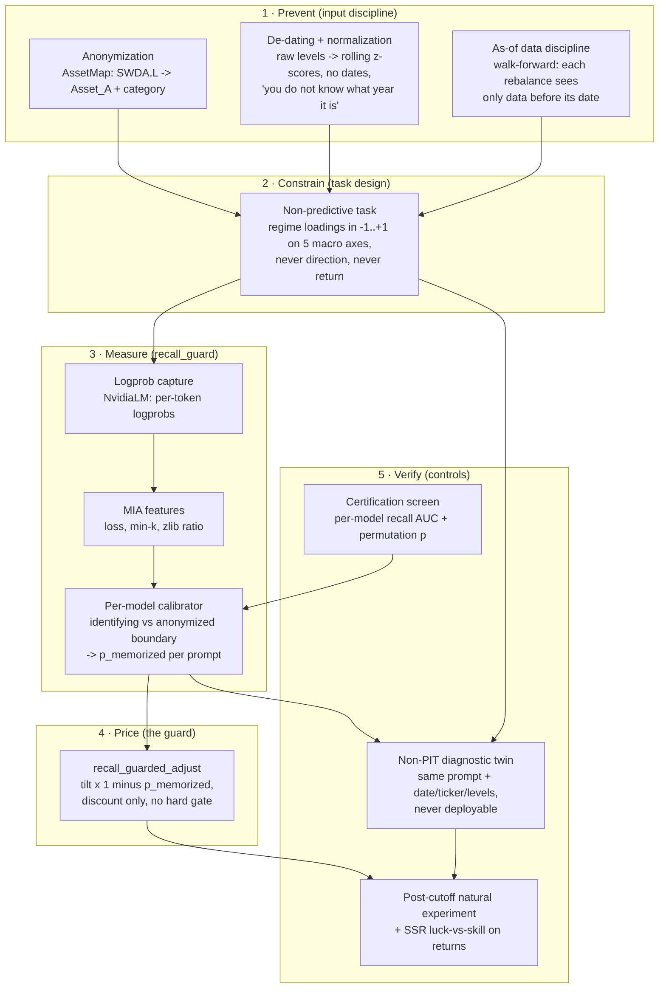

# How this system achieves point-in-time (PIT) inference

Reference description for the thesis illustration. Each component maps to code,
so the diagram can cite its implementation.

## The problem with just prompting

A naive prompt ("It is March 2022. CPI is 8.5%, the 10y-2y spread is -0.2. What
happens to SPY?") hands the model three keys to its own training data: the
date, the real ticker, and raw levels that fingerprint the period (a 9.1% CPI
print *is* June 2022). A model trained through 2024 can answer from memory and
the answer is indistinguishable from reasoning. There is no way, from the text
alone, to tell inference from recall. That is lookahead leakage through the
prompt, and it is the LLM version of an in-sample backtest.

## The PIT stack: five layers

The architecture treats contamination like a security problem: prevent what you
can, constrain the attack surface, measure what leaks anyway, price the
residual, and verify the whole thing with controls.

### Layer 1: prevent (input discipline)

- **Anonymization** (`macro_framework/anonymize.py`, `AssetMap`): real tickers
  never reach the prompt. Assets appear as `Asset_A..Asset_D` plus a category
  word. Removes the identity key.
- **De-dating and normalization** (`render_regime_loadings_prompt` in
  `macro_framework/factor_scoring.py`): the macro state is z-scored against a
  rolling window, raw levels are withheld, no calendar token appears, and the
  prompt states the model does not know what year it is. Removes the date key
  and the level fingerprint.
- **As-of discipline** (`mf.build_walk_forward_targets`): classic backtest
  hygiene. Every rebalance date is computed from data strictly before it,
  including the z-score windows. Removes lookahead in the numeric inputs
  themselves, independent of the LLM.

### Layer 2: constrain (task design)

The model characterizes the regime as continuous loadings on five named macro
axes. It is never asked for a direction or an expected return, so even a fully
contaminated reply has no channel to smuggle a forecast. Exposures come from a
fixed, documented axis-to-asset table (`loadings_to_tilt_views`); the
Black-Litterman conversion is reused unchanged.

### Layer 3: measure (recall_guard)

Prevention is never total, so contamination is measured per prompt rather than
assumed away. The scoring model's per-token logprobs (`NvidiaLM`) feed
membership-inference features (loss, min-k probability, zlib ratio), and a
per-model calibrator trained on the identifying-vs-anonymized boundary of the
same macro states maps them to `p_memorized` in [0, 1]. Implementation: the
[recall-guard](https://github.com/norandom/memguard_alpha) package (Roy & Roy
2026, arXiv:2603.26797), wired in `FactorScorer`.

### Layer 4: price (the guard)

`recall_guarded_adjust`: every exposure tilt is scaled by (1 − p_memorized).
A discount, not a gate: suspicious dates keep a voice, proportional to how
honest their prompt measured. This is where contamination stops being a caveat
and becomes a number in the portfolio math.

### Layer 5: verify (controls)

- **The non-PIT twin**: the same pipeline run with identifying prompts (date,
  tickers, raw levels added; otherwise token-identical). It exists to measure
  what the discipline prevents; it is never deployable. Measured gap in
  p_memorized: +0.54 in-training.
- **Certification screen**: before deployment, every candidate model is
  screened for recall on the controlled boundary (AUC, bootstrap CI,
  permutation p, positive control). Result here: no candidate was recall-free;
  the selected model runs guarded.
- **Post-cutoff experiment + SSR**: extending the stream past the model's
  training cutoff decomposes the measured premium into form-sensitivity
  (+0.36, persists on unseen dates) and true recall (~+0.18, only
  in-training). The Sharpe Stability Ratio then tests whether any of it
  survives in returns (it does not: differential SSR 0.02).

## What "just prompting" lacks, in one table

| Concern | Just prompting | This architecture |
|---|---|---|
| Identity leakage | tickers in prompt | anonymized asset letters |
| Date leakage | dates/years in prompt | de-dated, z-scored state |
| Level fingerprints | raw macro levels | rolling z-scores only |
| Data lookahead | whatever the context holds | as-of walk-forward slices |
| Forecast channel | model asked to predict | loadings only, no return ask |
| Contamination | unknowable | measured per prompt (p_memorized) |
| Residual memory | fully priced in | discounted by 1 − p_memorized |
| Validation | none | non-PIT twin, screen, post-cutoff, SSR |

The one-sentence version for the caption: *point-in-time inference is not a
prompt style but a stack — anonymize, de-date, restrict the data, remove the
forecast channel, then measure the leak that remains and charge it against the
position size, with a diagnostic twin proving the discipline does something.*
